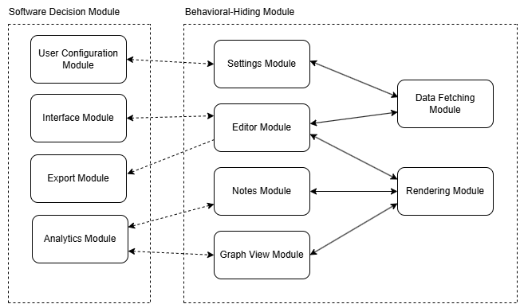

## Revision History

| **Date**      | **Version** | **Notes**          | **Author** |
| ------------- | ----------- | ------------------ | --------------- |
| Jan. 05 2025 | 0.0         | Created rough sketches for architecture| All |
| Jan. 10 2024 | 0.1         | Purpose | Waleed |
| Jan. 12 2024 | 0.2         | Project Overview/Diagrams | Waleed |
| Jan. 13 2024 | 0.3         | Updated Module Hierarchy and Table | Waleed |
| Jan. 16 2024 | 0.4         | Finished Module Decomposition | Waleed |

## Reference Material

This section records information for easy reference.

### Abbreviations and Acronyms

| **symbol** | **description**                     |
| ---------- | ----------------------------------- |
| AC         | Anticipated Change                  |
| DOM        | Document Object Model               |
| GPU        | Graphics Processing Unit            |
| M          | Module                              |
| MG         | Module Guide                        |
| OS         | Operating System                    |
| PDF        | Portable Document Format            |
| R          | Requirement                         |
| SRS        | Software Requirements Specification |
| \progname  | Explanation of program name         |
| UC         | Unlikely Change                     |

## Purpose

### System Purpose

The system is a web-based text editor designed to inspire creativity and make the writing process smoother and more enjoyable. It helps users explore their ideas in a non-linear way, offering interactive suggestions powered by advanced machine learning. 
With features like text steering, feedback, and note-style suggestions, the system gives writers the flexibility to refine their tone and structure while keeping full control over their work. Everything is stored locally on the user's computer, so there's no need for logins or worrying about data privacy.
Whether you are working on creative writing or structured documents, the system provides tools to plan, brainstorm, and fine-tune ideas. It's accessible through any modern web browser, ensuring a seamless experience without the hassle of installation or compatibility issues.

### Document Purpose

The purpose of this document is to illustrate and justify the decomposition of the tinymorph system into its core components and provide a Modular Guide for each module. 
This document will serve as a guide for the implementation of the system, ensuring all components are designed to achieve the system's goals effectively and maintain scalability, modularity, and user-friendliness.
This document will also serve as a basis for the implementation work scheduled to be completed in the coming months.

## Introduction

Decomposing a system into modules is a commonly accepted approach to developing software. A module is a work assignment for a programmer or programming team ^1. We advocate a decomposition based on the principle of information hiding[2]. This principle supports design for change, because the "secrets" that each module hides represent likely future changes. Design for change is valuable in SC,... where modifications are frequent, especially during initial development as the solution space is explored.

Our design follows the rules layed out by Parnas et al.[1], as follows:

- System details that are likely to change independently should be the secrets of separate modules.
- Each data structure is implemented in only one module.
- Any other program that requires information stored in a module's data structures must obtain it by calling access programs belonging to that module.

After completing the first stage of the design, the Software Requirements Specification (SRS), the Module Guide (MG) is developed[1]. The MG specifies the modular structure of the system and is intended to allow both designers and maintainers to easily identify the parts of the software. The potential readers of this document are as follows:

- New project members: This document can be a guide for a new project member to easily understand the overall structure and quickly find the relevant modules they are searching for.
- Maintainers: The hierarchical structure of the module guide improves the maintainers' understanding when they need to make changes to the system. It is important for a maintainer to update the relevant sections of the document after changes have been made.
- Designers: Once the module guide has been written, it can be used to check for consistency, feasibility, and flexibility. Designers can verify the system in various ways, such as consistency among modules, feasibility of the decomposition, and flexibility of the design.

The rest of the document is organized as follows. Section 2 lists the anticipated and unlikely changes of the software requirements. Section 3 summarizes the module decomposition that was constructed according to the likely changes. Section 4 specifies the connections between the software requirements and the modules. Section 5 gives a detailed description of the modules.... Section 6 includes two traceability matrices. One checks the completeness of the design against the requirements provided in the SRS. The other shows the relation between anticipated changes and the modules. Section 7 describes the use relation between modules.

## Anticipated and Unlikely Changes

This section lists possible changes to the system. According to the likeliness of the change, the possible changes are classified into two categories. Anticipated changes are listed in Section 2.1, and unlikely changes are listed in Section 2.2.

### Anticipated Changes

Anticipated changes are the source of the information that is to be hidden inside the modules. Ideally, changing one of the anticipated changes will only require changing the one module that hides the associated decision. The approach adapted here is called design for change.

- **AC1:** Integrating with newer language models, such as Llama 3.

\wss{Anticipated changes relate to changes that would be made in requirements, design or implementation choices. They are not related to changes that are made at run-time, like the values of parameters.}

### Unlikely Changes

The module design should be as general as possible. However, a general system is more complex. Sometimes this complexity is not necessary. Fixing some design decisions at the system architecture stage can simplify the software design. If these decision should later need to be changed, then many parts of the design will potentially need to be modified. Hence, it is not intended that these decisions will be changed.

- **UC1:** May not support integration with tools like Notion, Obsidian, and text editors such as Neovim and VSCode.

## Module Hierarchy

This section provides an overview of the module design. Modules are summarized in a hierarchy decomposed by secrets in Table 1. The modules listed below, which are leaves in the hierarchy tree, are the modules that will actually be implemented.

## Hardware-Hiding Module(s)
- **M1**:GPU/Hardware Acceleration Module

## Behaviour-Hiding Module(s)
- **M2**: Editor Module
- **M3**: Notes Module
- **M4**: Graph View Module
- **M5**: Settings Module
- **M6**: Rendering Module
- **M7**: Data Fetching and State Management Module

## Software Decision Module(s)
- **M8**: Inference Module
- **M9**: User Configuration Module
- **M10**: Analytics Module
- **M11**: Export and Integration Module

| **Level 1**                   | **Level 2**                   |
|-------------------------------|-------------------------------|
| **Hardware Hiding**           | GPU/Hardware Acceleration Module    |
| **Behaviour-Hiding**          | Editor Module                 |
|                               | Notes Module                  |
|                               | Graph View Module             |
|                               | Settings Module               |
|                               | Rendering Module              |
|                               | Data Fetching and State Management Module |
| **Software Decision**         | Inference Module              | 
|                               | User Configuration Module     | 
|                               | Analytics Module              | 
|                               | Export and Integration Module |

Table 1: Module Hierarchy

## Connection Between Requirements and Design

The design of the system is intended to satisfy the requirements developed in the SRS. In this stage, the system is decomposed into modules. The connection between requirements and modules is listed in Table 2.

<!-- The intention of this section is to document decisions that are made "between" the requirements and the design. To satisfy some requirements, design decisions need to be made. Rather than make these decisions implicit, they are explicitly recorded here. For instance, if a program has security requirements, a specific design decision may be made to satisfy those requirements with a password. -->

## Module Decomposition

Modules are decomposed according to the principle of "information hiding" proposed by Parnas et al.[1]. The _Secrets_ field in a module decomposition is a brief statement of the design decision hidden by the module. The _Services_ field specifies _what_ the module will do without documenting _how_ to do it. For each module, a suggestion for the implementing software is given under the _Implemented By_ title. If the entry is _OS_, this means that the module is provided by the operating system or by standard programming language libraries. _\progname{}_ means the module will be implemented by the \progname{} software. Only the leaf modules in the hierarchy have to be implemented. If a dash (_--_) is shown, this means that the module is not a leaf and will not have to be implemented.

### Hardware-Hiding

#### GPU/Hardware Acceleration Module (M1)
- **Secrets:** Algorithms for utilizing GPU resources to enhance performance, such as optimizing parallel computations for feature steering.
- **Services:** Accelerates computationally intensive tasks, such as generating text or rendering visualizations, by using GPU capabilities.
- **Implemented By:** GPU drivers, WebGL (if applicable).
- **Type of Module:** Abstract Object.

### Behaviour-Hiding

#### Editor Module (M2)
- **Secrets:** State management of the editor, including virtual DOM updates, handling of formatting rules, and integration of context-sensitive suggestions.
- **Services:** Serves as the maintain interface for text editing, providing features such as structured editing, real-time text previews, and contextual interactions. Supports seamless file parsing, note suggestions, and user-driven customizations.
- **Implemented By:** Frontend libraries.
- **Type of Module:** Abstract Data Type.

#### Notes Module (M3)
- **Secrets:** Storage mechanisms, data structures for dynamic note updates, and algorithms linking notes to specific contexts within the document.
- **Services:** Enables users to create, edit, delete, and manage notes in real time. Dynamically generates suggestions based on the document's context, aiding the user's creative process.
- **Implemented By:** Frontend libraries, Machine learning models.
- **Type of Module:** Library.

#### Graph View Module (M4)
- **Secrets:** Algorithms for translating document structures into graph visualizations and efficiently synchronizing the graph with real-time document edits.
- **Services:** Provides users with a graphical overview of the document's structure to aid in navigation and organization. Updates dynamically to reflect changes made in the editor, ensuring consistency between the text and its visual representation.
- **Implemented By:** Visualization libraries, State management.
- **Type of Module:** Abstract Object.

#### Settings Module (M5)
- **Secrets:** Mechanism for storing, retrieving, and applying user-specific preferences such as themes, font styles, and interface customizations.
- **Services:** Allows users to configure the application's appearance and behavior, maintaining these settings across sessions for a consistent experience. Adapts preferences dynamically based on user settings input.
- **Implemented By:** LocalStorage APIs.
- **Type of Module:** Abstract Data Type.

#### Rendering Module (M6)
- **Secrets:** Parsing and rendering algorithms for converting user input, such as Markdown, into formatted text. Techniques for applying visual enhancements like annotations and syntax highlighting.
- **Services:** Provides real-time previews of user content, enabling better visualization of the writing process. Enhances readability and interactivity through features such as dynamic formatting and highlights.
- **Implemented By:** Markdown libraries, Frontend rendering engines.
- **Type of Module:** Library.

#### Data Fetching and State Management Module (M7)
- **Secrets:** Data synchronization logic for handling drafts, preferences, and metadata between the local storage and the application state.
- **Services:** Ensures seamless data fetching, caching, and synchronization, preserving user progress and settings across sessions locally. Manages application state for a smooth, uninterrupted user experience.
- **Implemented By:** LocalStorage.
- **Type of Module:** Record.

### Software Decision

#### Inference Module (M8)
- **Secrets:** Integration techniques for advanced machine learning models, including parameter tuning and managing interactions between model outputs and user preferences.
- **Services:** Generates personalized text suggestions by analyzing user input and context. Adapts dynamically to user-defined parameters like tone, style, and creativity.
- **Implemented By:** Llama 3.
- **Type of Module:** Library.

#### User Configuration Module (M9)
- **Secrets:** Data structures and Algorithms for managing user-specific settings, including tone preferences, feature configurations, and real-time updates.
- **Services:** Maintains user preferences and applies them consistently across all features of the application. Ensures personalized experiences by dynamically adapting configurations during sessions.
- **Implemented By:** LocalStorage APIs.
- **Type of Module:** Record.

#### Analytics Module (M10)
- **Secrets:** Algorithms for tracking user progress metrics such as word count, tone consistency, and goal completion rates. Methods for generating insights and visual feedback.
- **Services:** Tracks real-time user progress and provides actionable insights to achieve writing goals. Offers intuitive feedback to guide users in improving their writing process.
- **Implemented By:** Frontend analytics tools.
- **Type of Module:** Library.

#### Export and Integration Module (M11)
- **Secrets:** Mechanism for formatting and exporting documents in multiple formats, such as Markdown and PDF, while preserving structure and integrity. Techniques for seamless integration with third-party tools.
- **Services:** Converts user content into export-ready formats and integrates with platforms like Google Docs or Notion for enhanced workflow and collaboration.
- **Implemented By:** REST APIs, Browser APIs.
- **Type of Module:** Abstract Object.

## Traceability Matrix

This section shows two traceability matrices: between the modules and the requirements and between the modules and the anticipated changes.

| **Req.** | **Modules**             |
| -------- | ----------------------- |
| R1       | M1, M2, M3, M4          |
| R2       | M2, M3                  |
| R3       | M5                      |
| R4       | M6, M4                  |
| R5       | M6, M7, M4, M8, M9, M10 |
| R6       | M6, M7, M4, M8, M9, M10 |
| R7       | M6, M11, M4, M8, M10    |
| R8       | M6, M11, M4, M8, M10    |
| R9       | M12                     |
| R10      | M6, M7, M4              |
| R11      | M6, M7, M11, M4         |

Table 2: Trace Between Requirements and Modules

| **AC** | **Modules** |
| ------ | ----------- |
| AC1    | M1          |
| AC2    | M2          |
| AC3    | M3          |
| AC4    | M5          |
| AC5    | M6          |
| AC6    | M12         |
| AC7    | M7          |
| AC8    | M11         |
| AC9    | M4          |
| AC10   | M8          |
| AC11   | M9          |
| AC12   | M10         |

Table 3: Trace Between Anticipated Changes and Modules

## Use Hierarchy Between Modules

In this section, the uses hierarchy between modules is provided. Parnas[3] said of two programs A and B that A _uses_ B if correct execution of B may be necessary for A to complete the task described in its specification. That is, A _uses_ B if there exist situations in which the correct functioning of A depends upon the availability of a correct implementation of B. Figure 1 illustrates the use relation between the modules. It can be seen that the graph is a directed acyclic graph (DAG). Each level of the hierarchy offers a testable and usable subset of the system, and modules in the higher level of the hierarchy are essentially simpler because they use modules from the lower levels.

\wss{The uses relation is not a data flow diagram. In the code there will often be an import statement in module A when it directly uses module B. Module B provides the services that module A needs. The code for module A needs to be able to see these services (hence the import statement). Since the uses relation is transitive, there is a use relation without an import, but the arrows in the diagram typically correspond to the presence of import statement.}

\wss{If module A uses module B, the arrow is directed from A to B.}

Figure 1: Use hierarchy among modules

## User Interfaces

\wss{Design of user interface for software and hardware. Attach an appendix if needed. Drawings, Sketches, Figma}

## Design of Communication Protocols

\wss{If appropriate}

## Timeline

\wss{Schedule of tasks and who is responsible}

\wss{You can point to GitHub if this information is included there}

## References

> [!important] UPDATE CORRECT LINKS
> UPDATE LINKS

[1]: Parnas, D.L., Clements, P.C. and Weiss, D.M., 1984. The modular structure of complex systems. In Proceedings of the 7th international conference on Software engineering (pp. 408-417).

[2]: Parnas, D.L., 1972. On the criteria to be used in decomposing systems into modules. Communications of the ACM, 15(12), pp.1053-1058.

[3]: Parnas, D.L., 1978. Some software engineering principles. Infotech State of the Art Report, 14(1), pp.237-247.
