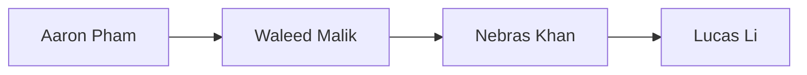

See also: [[Checklists/POC-Checklist|checklist]] and [[DevelopmentPlan/DevelopmentPlan#Revision|this document revision]]

The following includes a brief roadmap of the development plan for `tinymorph` from Team 23 (Hinterland).

## Confidential Information

There is no confidential information to protect for this project.

## IP to Protect

There is no IP to protect for this project.

## Copyright License

`tinymorph` is licensed under the [Apache-2.0](https://github.com/aarnphm/tinymorph/blob/main/LICENSE) license.

## Team Meeting Plan

Meeting will be run into two formats: Standup and Supervisor Meeting

| Meeting Type              | Frequency | Time (EST)      | Day    | Location                        | Agenda                                                                                                                                                            |
| ------------------------- | --------- | --------------- | ------ | ------------------------------- | ----------------------------------------------------------------------------------------------------------------------------------------------------------------- |
| Standup                   | Weekly    | **15:30-16:30** | Monday | Online via Teams                | • Round table format • What are you working on • Blockers? • Plan for this week                                                                          |
| Supervisor (w/ Dr.Mishra) | Bi-weekly | **12:00-13:00** | Friday | In person, at arranged location | • Progress update • Discussion regarding relevant research and potential solutions for UX interaction • Q&A session for any issues during development cycle |

Meeting chairs and notetakes will be responsible for ensuring that given issues are filled out.
For meeting with supervisors, notes should be taken under [[meetings]].

Roles assignment can be found under [[DevelopmentPlan/DevelopmentPlan#Team Member Roles|Team Member Roles]].

Additional meetings can also be held as needed (knowledge sharing, coworking, etc.)

## Team Communication Plan

Hinterland members will use Teams for all asynchronous and synchronous communication.

Additionally, GitHub [issue tracker](https://github.com/aarnphm/tinymorph/issues) should be used for feature
development. The Sprint [Kaban](https://github.com/users/aarnphm/projects/4?query=sort:updated-desc+is:open) board will
also be used concurrently for tracking tasks and in-progress work.

Expectations among team members with regards response to issues and pull requests assignments should be resolved within
1-2 business days. Should any issues arise that prevents members from using any of the aforementioned communication
methods, Email should be used to communicate with the rest of the team and the instructor.

## Team Member Roles

The following encapsulates member roles for Hinterland.

[Aaron Pham](https://aarnphm.xyz) will take the lead role for the team and acts as [BDFL](https://en.wikipedia.org/wiki/Benevolent_dictator_for_life) for `tinymorph`.
They will be responsible for overall project management, communication among course instructors, supervisor, as well as providing support to the rest of the team

Notetakers will be responsible for taking notes during meetings, lectures during the working week, and this role will
be rotated among team members on a four week basis. The following can be used:

> [!note] Meeting chair assignment
> Follow the schedule for notetakers.

Given that `tinymorph` will include two components (web-based editor and ML inference server), the following include
a rough draft of each champion's responsibilities:

- design work: The team will collaborate on general design works for interfaces, lead by [Aaron Pham](https://aarnphm.xyz).
- web-based editor: [Nebras Khan](https://github.com/nebrask).
- ML inference server: [Waleed Malik](https://github.com/waleedmalik7)
- SAE intervention: Lead by [Aaron Pham](https://aarnphm.xyz), with [Lucas Li](https://github.com/lucas-lizhiwei)

Reviewers will be assigned automatically based on the project they champion.

> [!note] Assignment
> Generally, everyone can work simultaneously on any of the three components mentioned above.

## Workflow Plan

`tinymorph` will follow a conventional git workflow, with `main` acts as "production" branch.
This means all changes should be work from a pull requests, and will be squashed into ==one== commit before pushing to
`main`.

This will ensure linear history.

`tinymorph` will use conventional commits for all commit messages as well as branch naming.

Issues should be created for all bugs, feature requests, and other work items, from predefined templates (blank
templates are provided, but only use this if any of the previous templates do not apply.) Issue can be optionally add
labels, add to milestone and Kaban board for progress checking.

[[Checklists]] can also be used to track changes for documentation-related tasks.

GitHub Actions will be used for CI/CD. The following enlists an overview of CI/CD for `tinymorph`:

- Documentation will be built automatically on every push to main as well as PR changes
- Each component will have its own CI pipeline for styling changes as well as tests (A/B testing)

## Project Decomposition and Scheduling

[Kaban](https://github.com/users/aarnphm/projects/4?query=sort:updated-desc+is:open) board through GitHub Projects will
be used for tracking tasks and deadlines. This board should already include certain triage, milestones, as well as
deadlines accordingly to course outline.

Additional features and functionalities will be added incrementally to the Kaban board.

See also [[Scratch|brain dump]] for more detailed features development.

## Proof of Concept Demonstration Plan

The following entails POC plan for `tinymorph` incoming November deadline:

- functional web-based text-editor, including feature tuning,
- Uses [Gemma 2](https://ai.google.dev/gemma?authuser=2) with pretrained [[glossary#sparse autoencoders|SAEs]] (see [GemmaScope](https://ai.google.dev/gemma/docs/gemma_scope)) for initial proof-of-concept steering.
- start training SAEs for Llama 3.1
- Running a OpenAI-compatible API inference server (remotely first, on BentoCloud).
- Vim-mode

Certain risks that may arise during the POC include:

- degradation of the generation quality due to incorrect feature steering.
- performance rendering with inlay within text buffers
- Modal editing won't work.
- e2e testing would be a hassle, given there are multiple components for tinymorph.
- Cold start for inference server.
- Mismanaging KV cache from vLLM internal block manager given that we are modifying attention activation directly.

To adverse given risks, the following will be implemented:

- Propose a low-fidelty prototype, followed by a design iteration for specific UX consideration.
- Trained a small sets of [[glossary#low-rank adapters|LoRA]] as backup to merge with Llama 3.1 on inference server, given that LoRA has been hardened by industry practice.

## Expected Technology

See also [CONTRIBUTING.md](https://github.com/aarnphm/tinymorph/blob/main/CONTRIBUTING.md) and [[DevelopmentPlan/DevelopmentPlan#Coding Standard|Style]]

The following stack will be divided into two parts: web-based editor (morph) and ML inference server (asteraceae)

No plans for code coverage, as it is usually a waste-of-time early on. Development will be tracked through `git`,
`GitHub`, as well as GitHub Projects for sprint progress.

Editor of choice should depends on whatever is the one that makes you move the fastest. For me, it is [Neovim](https://neovim.io/)

### documentation

Generated with [Quartz](https://quartz.jzhao.xyz/), hosted on GitHub Pages.

One can use any file-based markdown editor to update documentation, but recommend to use [Obsidian](https://obsidian.md/)

Design file will be using [Figma](https://figma.com) for high-fidelity prototype, [Excalidraw](https://excalidraw.com/)
for low-fidelity prototype.

Citations will use [Chicago Manual of Style](https://www.chicagomanualofstyle.org/tools_citationguide.html) with
a custom [CSL](https://github.com/aarnphm/tinymorph/blob/main/docs/content/chicago-fullnote-bibliography.csl) for supporting footnotes

### web-based editor (morph)

Language: JS/TS

Stack:

- rendering: Any React-based framework, e.g. Next, w/ Node backend.
- styling: SASS, framer-motion, @shadcn/ui
- testing: Jest

Formatter: prettier

Linter: eslint

Bundler/Transpiler: vite/esbuild

CI: include styling and linter, possibly a small set of A/B tests.

tool: [`pnpm`](https://pnpm.io/) for monorepo workspace management

### ml inference server (asteraceae)

Language: Python

Stack:

- online inference: BentoML, vLLM, pydantic
- offline inference: [llama.cpp](https://github.com/ggerganov/llama.cpp)
- testing: pytest

Linter: ruff

CI: include styling and linter, regression testing, e2e testing.

Model: Gemma 2 for SAE exploration, Llama 3.1 for final models (for POC specifically, will also train a few LoRAs for writers tonality)

Tool: [`uv`](https://github.com/astral-sh/uv) for monorepo management

## Coding Standard

### TS/JS

[Google style guide](https://google.github.io/styleguide/) will be used.

All related tools has been setup corespondingly.

### Python

A variation of Google style guide for Python will be used.

![[DevelopmentPlan/python style#The coding style|variation]]

---

## Appendix

### Revision

| Date          | Developer(s) | Change                           |
| ------------- | ------------ | -------------------------------- |
| Sept. 16 2024 | 0.0          | Initial skafolding               |
| Sept. 22 2024 | 0.1          | Initial POC and Development Plan |

### Reflection

  <a class="name" href="https://github.com/aarnphm">Aaron</a>

It is important to create a development plan prior to starting the project to ensure goal alignment, timelines,
required resources and potential risks are evaluated accordingly. It enables better team coordination and planning on
feature development, as well as providing a baseline to measure progress against. Additionally, it also helps with
preventing scope creep by clearly defining goals and objectives to be achieved.

CI/CD, ensures faster development iterations and improve code quality through automated testing. It also
helps with earlier bug detection and prevent regressions. However, depending on the stage of the project (given that
tinymorph is relatively new and small), setting CI/CD is a huge hassle as one will have to manage the infrastructure
as well as complexity of these pipelines. This will actually inversely introduce a lot of technical debt and slow down
development cycle. This is also known as _premature optimisation_.

> CI/CD is the case of "pick your poison"

We don't have any disagreements with regards to this deliverable, given that I asked for everyone preferences and let
the technology stack to be made by project champion.

<!-- 1. Why is it important to create a development plan prior to starting the project? -->
<!-- 2. In your opinion, what are the advantages and disadvantages of using CI/CD? -->
<!-- 3. What disagreements did your group have in this deliverable, if any, and how did you resolve them? -->

### Team Charter

borrows from [University of Portland Team Charter](https://engineering.up.edu/industry_partnerships/files/team-charter.pdf)

#### External Goals

Take a step back, our goal for `tinymorph` is to imagine what machine-assisted interfaces for creative writing would look like[^1].

[^1]: [[ProblemStatementAndGoals/ProblemStatement#Problem|problem statement.]]

There are two narratives emerging from industry practitioners and companies with regards to the [intelligence age](https://ia.samaltman.com/): Entities that seek to build systems capable of outperforming
at tasks that a human can do at a greater degree of accuracy and efficiency. These companies include OpenAI, Anthropic, [SSI](https://ssi.inc/), many AI labs, etc.
and often disguised these systmems under the term "artificial super intelligence" (ASI). On the other end of spectrum, we have
companies that build AI systems to amplify our abilities to create and improve efficiency for our work. Companies such
as [Runway](https://runwayml.com/), [Cohere](https://cohere.com/), etc belongs to this paradigm. ^intelligence

Our interests lie firmly on the second group, where we build tools that amplifies our agency. `tinymorph` is the manifestation of these beliefs.

Additionally, during the journey of prototyping `tinymorph`, we hope to use it as a playground to delve into the field of [[glosar#mechanistic interpretability]] as a pure research interests.

#### Attendance

##### Expectations

Every team member should be expected to attend all standup and supervisor meetings. For lectures, coresponding
notetaker should be present as a point of contact during lecture time.

Communication methods include asynchronous and synchronous, via Teams and Email if necessary.

##### Acceptable Excuse

Should anything urgent may arise, such as family matters or health issues, one should inform the team ASAP so that
everyone else can allocate and focus on covering the tasks at hand.

We hope to cultivate a healthy work culture where everyone is encouraged to prioritise their health and well-being. If
there are any specific concerns one should explicitly address with the whole team, or resolve the matter privately with
all concerned parties.

##### In Case of Emergency

What process will team members follow if they have an emergency and cannot attend a team meeting or complete their individual work promised for a team deliverable?

Please let everyone know through Teams, email Dr.Smith about this specific incident so that the others members can cover the team deliverable.

#### Accountability and Teamwork

##### Quality

What are your team's expectations regarding the quality of team members' preparation for team meetings and the quality of the deliverables that members bring to the team?

We expect all team members to try their best at constructing features works and contributions to documentation. Members
are expected to become the domain experts for topics that they are championing, while everyone else should understand
certain decisions and tradeoff behind design choices.

For meeting preparation, we expect everyone to come prepared with questions and discussion topics they want to do.

##### Attitude

Adhering to [Code of Coduct](https://github.com/aarnphm/tinymorph/blob/main/.github/CODE_OF_CONDUCT.md) adapted from the [Contributor Covenant](https://www.contributor-covenant.org), [version 2.0](https://www.contributor-covenant.org/version/2/0/code_of_conduct.html).

We encouraged everyone to be open to new ideas and collaborate on features work. We should use constructive critism with regards doing review work.

Should any conflict arise, please discuss your concern and display your reasoning with the whole team, asynchronously or synchronously. At the end of the day, we are all humans 😀

##### Stay on Track

We will use standup [notes](https://github.com/aarnphm/tinymorph/issues?q=is:issue+is:closed+meeting+) to keep track of everyone progress.

For metrics, try to show up for meetings, and push your progress through draft PR to show your current progression.

##### Decision Making

The team will follow a concensus voting model with regards features design and implementation decisions.

Should there be a split vote, BDFL will have the final say.
