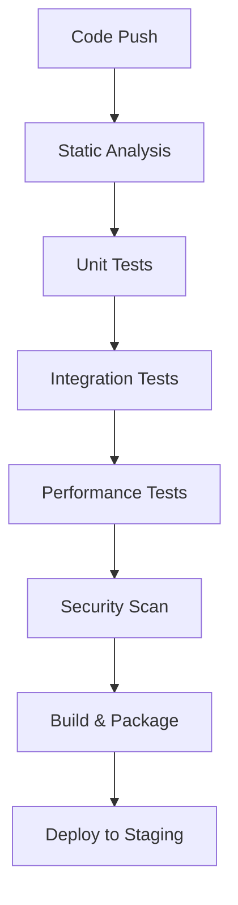

## 1 Introduction

This document outlines the comprehensive testing strategy for `tinymorph`, a web-based text editor that explores new interfaces for machine-assisted creative writing. The plan ensures that tinymorph meets its primary objectives: providing spatial interfaces for non-linear exploration of writing, implementing efficient feature steering through sparse autoencoders (SAEs), and maintaining a file-over-app philosophy that preserves user agency.
The V&V activities described in this document cover both the web-based editor (morph) and the ML inference server (asteraceae). Key areas of validation include:

- Verification of the planning interface and suggestion generation capabilities
- Testing of feature steering mechanisms using SAEs
- Validation of the OpenAI-compatible inference API
- Assessment of system performance, particularly Time-to-First-Token (TTFT) and throughput
- Evaluation of user interaction patterns and accessibility features
- Verification of security measures and data privacy controls

## 2 General Information

### 2.1 Symbols, Abbreviations, and Acronyms

The following data dictionary from [[SRS/SRS]] will be used for the symbols:

![[SRS/SRS#7.2 Data Dictionary|data dictionary]]

Additionally the following abbreviations will be used:

| symbols | description                        |
| ------- | ---------------------------------- |
| T       | Test                               |
| V&V     | Verification and Validation        |
| UI      | User Interface                     |
| SRS     | Software Requirement Specification |
| CI      | Continuous Integration             |

### 2.2 Purpose

V&V Plan outlines the testing, validation and verification procedures that are to be implemented
`tinymorph`.

> [!important] revisions
>
> Test cases mentioned in this document are subject to change based on the development progress and feedback from the supervisor and peers. The plan will be updated accordingly to ensure that all aspects of the system are thoroughly tested and validated.

### 2.3 Scope

The following entails the scope of the V&V plan for `tinymorph`:

#### 2.3.1 In scope V&V Objectives

- Functional verification of the web-based editor (morph), including:

  - Text editing capabilities and file management
  - Planning interface functionality
  - Version control features
  - Configuration and preference management
  - Accessibility features and keyboard navigation

- Validation of the ML inference server (asteraceae), covering:

  - Feature steering using [[glossary#sparse autoencoders]] (SAEs)
  - OpenAI-compatible API endpoints
  - Performance metrics (TTFT, throughput)
  - Batch processing capabilities
  - KV cache optimization

- Security and compliance testing:

  - HTTPS encryption for all communications
  - Data privacy controls
  - Content filtering for harmful outputs
  - SOC 2 compliance validation

- User experience validation:

  - Usability testing of core writing features
  - Response time measurements
  - Cross-browser compatibility
  - Theme customization
  - Accessibility compliance

- Integration testing between components:
  - Editor-server communication
  - File system interactions
  - Feature steering feedback loop

#### 2.3.2 Out of scope V&V Objectives

- Testing of underlying language models (Gemma 2, Llama 3.1)
- Validation of third-party libraries and frameworks (React, BentoML, vLLM)
- Hardware-specific performance optimization
- Testing on unsupported browsers or operating systems
- Penetration testing of infrastructure components
- Cloud provider-specific testing (beyond basic deployment verification)
- Testing of external API integrations beyond OpenAI compatibility
- Validation of multilingual support (initial release focuses on English)

![[ProblemStatementAndGoals/ProblemStatement#Challenge Level and Extras]]

### 2.5 Relevant documentation

See also [[SRS/SRS|Software Requirement Specification]] and [[HazardAnalysis/HazardAnalysis|Hazard Analysis]] documents
for more information

## 3 Plan

This section provides general information about the plan of testing, including testing team members, milestones and detailed sections of verifications.

### 3.1 Verification and Validation Team

The following project members are responsible for all procedures of the validation process, including writing and executing tests:

| Team Member     | Responsibility                                                                                         |
| --------------- | ------------------------------------------------------------------------------------------------------- |
| **Aaron Pham**   | SRS Verification: ensure the SRS document accurately describes system functionalities and constraints. Implementation Verification (specifically functional requirements and performance): Ensures implemented features align with the SRS specifications.    |
| **Nebras Khan**  | Design Verification(evaluate software architecture), UI/UX testing(Consistency and Usability), and system interaction validation(API interaction)                                 |
| **Waleed Malik** | Automated Testing (focusing on backend logic, integration tests, and continuous integration pipelines)    |
| **Zhiwei Li**    | Software Validation (end-to-end testing by simulating real user, regression testing for new features for each stage, and security testing for vulnerability)                     |
| **Dr. Spencer Smith** | Project Supervisor |
| **Dr. Swati Mishra** | Project Supervisor |
| **Hunter Ceranic** | Teaching Assistent as Project Supervisor |

**Regular Guidance and Review:**  
- Weekly reviews and feedback sessions with Dr. Swati Mishra to ensure testing progress aligns with project milestones and system requirements.  
- Additional support and guidance will be provided by TA Hunter Ceranic as needed, especially during critical testing phases.  

**Collaborative Testing:**  
- Verification and validation tasks related to large documents (e.g., the SRS) will be divided among team members based on their expertise. Multiple team members may collaborate on key sections to ensure thorough coverage and efficiency.  
- Overlapping areas will be coordinated during team meetings to avoid redundancy and ensure clear role allocation.

### 3.2 Milestones

Following table contains dates relevant to important milestones

| **Testing**                          | **Expected Date of Completion** |
| ------------------------------------ | ------------------------------- |
| Look and Feel Testing                |       2025-01-10                |
| Usability and Humanity Testing       |       2025-01-15                |
| Performance Testing                  |       2025-01-20                |
| Security Testing                     |       2025-02-20                |
| Maintainability and Support Testing  |       2025-02-05                |
| Compliance Testing                   |       2025-01-20                |
| Unit Testing                         |       2025-02-05                |
| Tests for Nonfunctional Requirements |       2025-02-05                |

_Table 3: Milestones_

### 3.3 SRS Verification Plan

The verification of the SRS will follow a systematic approach to ensure completeness, consistency, and alignment with project goals. This process will occur over a one-month period and involve multiple stakeholders.

#### 3.3.1 Review Approaches

1. **Supervisor Reviews**

   - Weekly 15-minute discussion sessions during regular meetings
   - Focus on technical feasibility and scope alignment
   - Documentation of feedback and required changes
   - Follow-up verification of implemented changes

2. **Internal Team Reviews**

   - Bi-weekly structured review sessions
   - Each team member assigned specific sections for detailed review
   - Cross-validation of requirements between related sections
   - Documentation of findings in a shared review log

3. **Requirements Traceability**

   - Mapping requirements to design elements
   - Verification of requirement dependencies
   - Identification of gaps or overlaps
   - Documentation of requirement relationships

4. **External Peer Review**:
   - Inviting feedback from peers outside the development team
   - Review of requirements documentation and clarity
   - Identification of potential conflicts or ambiguities
   - Documentation of external feedback and proposed changes

#### 3.3.2 Structured Review Process

1. **Individual Review Phase** (Week 1)

   - Team members review assigned sections
   - Document initial findings and concerns
   - Identify potential conflicts or ambiguities
   - Prepare discussion points for team review

2. **Team Review Phase** (Week 2)

   - Group discussion of individual findings
   - Resolution of identified issues
   - Documentation of decisions and changes
   - Update of requirements based on feedback

3. **Supervisor Review Phase** (Week 3)

   - Present consolidated findings
   - Incorporate supervisor feedback
   - Document required changes
   - Plan implementation timeline

4. **Final Verification Phase** (Week 4)
   - Implement all approved changes
   - Final review of updates
   - Version control and documentation
   - Sign-off on verified requirements

#### 3.3.3 Verification Checklist

**Completeness**

- [ ] All functional requirements have clear acceptance criteria
- [ ] Non-functional requirements are measurable and testable
- [ ] User interface requirements cover all interaction points
- [ ] Performance metrics are clearly defined
- [ ] Security requirements address all identified risks

**Consistency**

- [ ] No conflicts between requirements
- [ ] Terminology is used consistently throughout
- [ ] Requirements align with project goals
- [ ] Dependencies are properly identified
- [ ] Priorities are consistently applied

**Clarity**

- [ ] Requirements are unambiguous
- [ ] No use of unclear terms or jargon
- [ ] Each requirement is atomic and verifiable
- [ ] Rationale is provided for key decisions
- [ ] Constraints are clearly stated

**Technical Feasibility**

- [ ] Resource requirements are realistic
- [ ] Performance targets are achievable
- [ ] Technology choices are justified
- [ ] Integration points are well-defined
- [ ] Scalability considerations are addressed

**Documentation Quality**

- [ ] Document follows template guidelines
- [ ] Sections are properly cross-referenced
- [ ] Version control is maintained
- [ ] Changes are tracked and justified
- [ ] Supporting diagrams are clear and accurate

The verification process will be coordinated by [Aaron Pham](https://github.com/aarnphm), with specific section ownership assigned to team members based on their areas of expertise. Progress will be tracked through GitHub issues, and final verification results will be documented in the project repository.

### 3.4 Design Verification Plan

Design reviews will be conducted with supervisor during the weekly meet-up, performing iterative reviews to cover different parts of the design.
Each review session will focus on verifying that design choices meet the functionality of performance needs specified in the SRS.

POC demo session will also be used for design verification. This process will take a month.

After the SRS review period, design verification will be conducted through iterative reviews with supervisors during weekly meetings. Each review session will focus on verifying that design choices meet the functional and performance requirements specified in the SRS.

#### 3.4.1 Specification Verification

| Category         | Verification Items                       | Acceptance Criteria                                             | Method                                  |
| ---------------- | ---------------------------------------- | --------------------------------------------------------------- | --------------------------------------- |
| Architecture     | System components and their interactions | Matches SRS architecture diagrams; Clear separation of concerns | Design review, Architecture walkthrough |
| Data Flow        | Data handling between components         | Follows file-over-app philosophy; Efficient data transmission   | Flow diagram review, Data path analysis |
| Interface Design | API contracts and UI components          | OpenAI-compatible endpoints; Consistent UI patterns             | API spec review, UI mockup validation   |
| Security Design  | Authentication and data protection       | Meets SOC2 requirements; Implements secure communication        | Security design review                  |
| Deployment       | Infrastructure and scaling strategy      | Supports auto-scaling; Enables zero-downtime updates            | Infrastructure diagram review           |

#### 3.4.2 Functional Verification

| Component          | Design Aspects                      | Verification Method                      | Success Criteria                           |
| ------------------ | ----------------------------------- | ---------------------------------------- | ------------------------------------------ |
| Text Editor        | Buffer management, File operations  | Code review, Prototype testing           | Smooth text manipulation, File persistence |
| Planning Interface | Layout, Interaction flow            | UI/UX review, User testing               | Intuitive navigation, Clear feedback       |
| Feature Steering   | SAE integration, Activation caching | Technical review, Performance testing    | Accurate steering, Efficient caching       |
| Version Control    | Diff tracking, History management   | Design review, Data structure validation | Reliable version tracking                  |
| Inference Server   | Request handling, Model integration | API review, Load testing                 | Meets TTFT requirements                    |

#### 3.4.3 Performance Verification

| Metric            | Target                     | Measurement Method       | Verification Approach                 |
| ----------------- | -------------------------- | ------------------------ | ------------------------------------- |
| TTFT              | 200-500ms                  | Response time monitoring | Load testing with varying batch sizes |
| Throughput        | 300 tokens/sec (batch=4)   | Request processing rate  | Concurrent request simulation         |
| Memory Usage      | <500MB per session         | Resource monitoring      | Memory profiling during operations    |
| UI Responsiveness | <50ms input latency        | Input lag measurement    | UI performance testing                |
| Cache Hit Rate    | >80% for common operations | Cache statistics         | Operation pattern analysis            |

#### 3.4.5 Documentation Validation

| Document Type          | Review Focus                  | Validation Method               | Reviewers     |
| ---------------------- | ----------------------------- | ------------------------------- | ------------- |
| API Documentation      | Completeness, accuracy        | Spec review, Example validation | Backend team  |
| User Guide             | Clarity, coverage             | User testing, Content review    | UX team       |
| System Architecture    | Consistency, completeness     | Technical review                | Tech leads    |
| Deployment Guide       | Accuracy, reproducibility     | Trial deployment                | DevOps team   |
| Security Documentation | Compliance, comprehensiveness | Security audit                  | Security team |

#### 3.4.6 Review Schedule

1. **Initial Design Review** (Week 1)

   - Architecture overview
   - Component interaction validation
   - Initial performance projections

2. **Detailed Component Review** (Week 2)

   - Individual component design
   - Interface specifications
   - Data flow validation

3. **Performance Design Review** (Week 3)

   - Caching strategy
   - Resource optimization
   - Scaling approach

4. **Integration Design Review** (Week 4)
   - Component integration
   - End-to-end flow
   - System resilience

#### 3.4.7 Validation Tools

| Category      | Tool          | Purpose             | Usage Phase   |
| ------------- | ------------- | ------------------- | ------------- |
| Code Analysis | ruff, eslint  | Static analysis     | Development   |
| Performance   | k6, Artillery | Load testing        | Integration   |
| Security      | OWASP ZAP     | Security scanning   | Pre-release   |
| Documentation | Vale          | Style consistency   | Documentation |
| API Testing   | Postman       | Endpoint validation | Development   |

#### 3.4.8 Design Verification Checklist

- [ ] Architecture aligns with SRS requirements
- [ ] Component interfaces are well-defined
- [ ] Performance targets are achievable with design
- [ ] Security considerations are addressed
- [ ] Scalability is built into design
- [ ] Documentation is complete and accurate
- [ ] Testing strategy is comprehensive
- [ ] Resource requirements are specified
- [ ] Error handling is well-defined
- [ ] Monitoring and logging are planned

This design verification plan will be executed in parallel with the development process, with findings and updates tracked through GitHub issues. Regular reviews will ensure that the implementation stays aligned with the verified design.

### 3.5 Implementation Verification Plan

In-group code walkthrough inspection is chosen as the main method to complete implementation verification of the project. The coding contents will be reviewed by other team members in exchange asynchronously. Basic grammar error in coding will be caught by linter of each different components. Detailed test cases can be found in system testing.

Final presentation is also expected to be a part of verification of usability, and its feedback will be collected and reflected on the final release.

### 3.6 Automated Testing and Verification Tools

The following include tools and automated tests that will be used for the verification of the system.

The automated testing strategy for `tinymorph` is divided into two main components: the web-based editor (`morph`) and the ML inference server (`asteraceae`). Each component has specific tooling requirements and testing frameworks to ensure comprehensive coverage.

#### 3.6.1 `morph`

| Category        | Tool       | Purpose                      | Configuration                                                                                                                    |
| --------------- | ---------- | ---------------------------- | -------------------------------------------------------------------------------------------------------------------------------- |
| Unit Testing    | Jest       | Component-level testing      | - Custom matchers for React components<br>- Coverage threshold: 80%<br>- Snapshot testing for UI components                      |
| End-to-End      | Playwright | Browser automation testing   | - Cross-browser testing (Chrome, Firefox, Safari)<br>- Device emulation for responsive testing<br>- Network condition simulation |
| Performance     | Lighthouse | Frontend performance metrics | - Performance score target: >90<br>- First Contentful Paint < 1.5s<br>- Time to Interactive < 3.0s                               |
| Accessibility   | axe-core   | WCAG compliance testing      | - WCAG 2.1 Level AA compliance<br>- Automated accessibility checks<br>- Color contrast validation                                |
| Static Analysis | ESLint     | Code quality enforcement     | - TypeScript-specific rules<br>- React hooks linting<br>- Import sorting                                                         |
| Style Checking  | Prettier   | Code formatting              | - 2-space indentation<br>- Single quotes<br>- No semicolons                                                                      |

#### 3.6.2 `asteraceae`

| Category        | Tool                         | Purpose                         | Configuration                                                                                   |
| --------------- | ---------------------------- | ------------------------------- | ----------------------------------------------------------------------------------------------- |
| Unit Testing    | pytest                       | Backend logic testing           | - Asyncio support<br>- Fixture-based test data<br>- Parallel test execution                     |
| Performance     | k6                           | Load and stress testing         | - TTFT verification<br>- Concurrent request handling<br>- Resource utilization monitoring       |
| API Testing     | [locust](https://locust.io/) | API endpoint validation         | - OpenAI compatibility testing<br>- Response schema validation<br>- Error handling verification |
| Static Analysis | ruff                         | Code quality checks             | - Type checking<br>- Import sorting<br>- Code complexity limits                                 |
| Security        | Bandit                       | Security vulnerability scanning | - Known vulnerability checks<br>- Security best practices<br>- Dependency scanning              |

#### 3.6.3 CI Pipeline



#### 3.6.4 Testing Environment Configuration

| Environment | Purpose                   | Configuration                                                          | Update Frequency |
| ----------- | ------------------------- | ---------------------------------------------------------------------- | ---------------- |
| Development | Local testing             | - Hot reloading<br>- Mock services<br>- Debug logging                  | Real-time        |
| Integration | Component testing         | - Containerized services<br>- Test databases<br>- Limited resources    | Per PR           |
| Staging     | Pre-production validation | - Production-like setup<br>- Full monitoring<br>- Load testing enabled | Daily            |
| Production  | Live deployment           | - High availability<br>- Full security<br>- Performance monitoring     | Weekly           |

#### 3.6.5 Automated Testing Requirements

1. **Code Coverage Requirements**

   - Frontend (morph): 80% overall coverage
   - Backend (asteraceae): 85% overall coverage
   - Critical paths: 100% coverage

   **Enforcement Mechanism in CI/CD Pipeline:**  
   - CI/CD jobs will run automated test coverage checks after each commit using Cloudflare and Vercel pipelines.  
   - If coverage thresholds are not met, merges to the main branch will be blocked using pre-merge checks in the pipeline.  
   - Automated coverage reports will be generated by the CI/CD pipeline and shared with the development team.  
   - Email notifications will be sent to developers when test coverage requirements are not met, providing details on failed areas.  

2. **Performance Testing Thresholds**

   ```javascript
   const performanceThresholds = {
     ttft: "500ms", // Time to First Token
     p95: "2s", // 95th percentile response time
     errorRate: "1%", // Maximum error rate
     throughput: "300", // Tokens per second
   }
   ```

3. **Testing Hooks**

   ```bash
   # Pre-commit hooks
   pre-commit:
     - ruff check
     - eslint
     - prettier
     - type checking

   # Pre-push hooks
   pre-push:
     - unit tests
     - integration tests
     - build verification
   ```

#### 3.6.6 Quality Gates

| Stage        | Criteria                                                                   | Action on Failure |
| ------------ | -------------------------------------------------------------------------- | ----------------- |
| Pull Request | - All tests pass<br>- Coverage thresholds met<br>- No security issues      | Block merge       |
| Integration  | - E2E tests pass<br>- Performance metrics met<br>- API contract tests pass | Notify team       |
| Deployment   | - Smoke tests pass<br>- No regression<br>- Security scan clean             | Rollback          |

#### 3.6.7 Monitoring and Reporting

| Metric Type  | Tools          | Frequency  | Alert Threshold          |
| ------------ | -------------- | ---------- | ------------------------ |
| Test Results | GitHub Actions | Per commit | Any failure              |
| Coverage     | Codecov        | Per PR     | < 80%                    |
| Performance  | Grafana        | Real-time  | TTFT > 500ms             |
| Security     | Snyk           | Daily      | Critical vulnerabilities |

### 3.7 Software Validation Plan

The software validation process ensures that `tinymorph` meets user requirements and functions effectively in its intended environment. This plan outlines the systematic approach to validating the system through user testing, performance analysis, and functionality verification.

#### 3.7.1 Validation Approach

| Phase             | Focus Area            | Methods                                | Success Criteria               |
| ----------------- | --------------------- | -------------------------------------- | ------------------------------ |
| Alpha Testing     | Core functionality    | Internal testing, Developer validation | Basic feature completeness     |
| Beta Testing      | User experience       | Limited user group testing             | User satisfaction metrics      |
| Release Candidate | Production readiness  | Full system validation                 | All validation criteria met    |
| Post-Release      | Production monitoring | User feedback, Performance metrics     | Continuous improvement metrics |

#### 3.7.2 User Validation Groups

| Group             | Description                       | Size         | Duration               | Focus Areas                               |
| ----------------- | --------------------------------- | ------------ | ---------------------- | ----------------------------------------- |
| Internal Users    | Development team and stakeholders | 5-8 people   | Throughout development | Feature completeness, Technical stability |
| Beta Users        | Selected writers and engineers    | 15-20 people | 4 weeks                | User experience, Feature utility          |
| Usability Testers | UX researchers and target users   | 10-12 people | 2 weeks                | Interface design, Accessibility           |
| Production Pilots | Early adopters                    | 30-50 people | 6 weeks                | Real-world usage, Performance             |

#### 3.7.3 Validation Scenarios

| Category            | Scenario                                      | Success Criteria                                                                          | Validation Method                     |
| ------------------- | --------------------------------------------- | ----------------------------------------------------------------------------------------- | ------------------------------------- |
| Creative Writing    | Complete essay draft using planning features  | - Successful plan creation<br>- Effective suggestion integration<br>- Smooth writing flow | User observation, Feedback collection |
| Feature Steering    | Customize text generation with specific style | - Accurate style adaptation<br>- Consistent outputs<br>- User satisfaction                | Style comparison analysis             |
| Document Management | Create and manage multiple writing projects   | - Reliable file operations<br>- Effective organization<br>- Version control accuracy      | User workflow analysis                |
| Collaborative Use   | Multiple users working on shared documents    | - Consistent performance<br>- Feature accessibility<br>- Clear user permissions           | Multi-user testing                    |

#### 3.7.4 Validation Metrics

| Metric Category    | Key Indicators                                                                        | Target Values                                                    | Collection Method        |
| ------------------ | ------------------------------------------------------------------------------------- | ---------------------------------------------------------------- | ------------------------ |
| User Satisfaction  | - Net Promoter Score<br>- Feature usefulness rating<br>- Interface satisfaction       | - NPS > 40<br>- Rating > 4/5<br>- >80% satisfied                 | User surveys, Interviews |
| Performance        | - Response time<br>- Feature availability<br>- Error rate                             | - TTFT < 500ms<br>- 99.9% uptime<br>- <1% error rate             | Automated monitoring     |
| Feature Adoption   | - Feature usage rates<br>- Return user rate<br>- Session duration                     | - >70% feature usage<br>- >60% return rate<br>- >15 min sessions | Analytics tracking       |
| Writing Efficiency | - Time to complete drafts<br>- Suggestion acceptance rate<br>- Planning feature usage | - 20% time reduction<br>- >50% acceptance<br>- >30% usage        | User metrics, Surveys    |

#### 3.7.5 Validation Process

1. **Pre-validation Setup**

   - Environment preparation
   - Test data creation
   - User group selection
   - Success criteria documentation

2. **Validation Execution**

   - Structured testing sessions
   - User feedback collection
   - Performance monitoring
   - Issue tracking

3. **Data Collection**

   - Automated metrics gathering
   - User surveys
   - Interview sessions
   - Performance logs

4. **Analysis and Reporting**
   - Metrics analysis
   - User feedback synthesis
   - Issue categorization
   - Improvement recommendations

#### 3.7.6 Validation Schedule

| Stage            | Timeline   | Activities                                                                         | Deliverables             |
| ---------------- | ---------- | ---------------------------------------------------------------------------------- | ------------------------ |
| Planning         | Week 1-2   | - Validation strategy development<br>- Test group formation<br>- Environment setup | Validation plan document |
| Alpha Testing    | Week 3-6   | - Internal testing<br>- Core feature validation<br>- Performance baseline          | Alpha test report        |
| Beta Testing     | Week 7-10  | - User group testing<br>- Feature refinement<br>- Performance optimization         | Beta test report         |
| Final Validation | Week 11-12 | - Full system validation<br>- Documentation review<br>- Release preparation        | Final validation report  |

#### 3.7.7 Acceptance Criteria

| Component         | Criteria                                                                                        | Validation Method                      |
| ----------------- | ----------------------------------------------------------------------------------------------- | -------------------------------------- |
| Text Editor       | - Text manipulation responsiveness<br>- File operation reliability<br>- Interface accessibility<br>- Customizable visualization workflows | Usability testing, Performance metrics, Accessibility testing |
| Planning Features | - Suggestion relevance<br>- Planning workflow efficiency<br>- User satisfaction<br>- Customizable task and progress options                 | User feedback, Feature usage analysis, Workflow adaptability testing  |
| Feature Steering  | - Style accuracy<br>- Generation consistency<br>- User control effectiveness                    | Style analysis, User validation, Customization testing        |
| Performance       | - Response time targets<br>- System stability<br>- Resource utilization                         | Automated monitoring, Load testing     |
| Security          | - Data privacy<br>- Access control<br>- Secure communication                                    | Security audit, Penetration testing    |

#### 3.7.8 Issue Management

| Priority | Response Time | Resolution Time | Escalation Path                    |
| -------- | ------------- | --------------- | ---------------------------------- |
| Critical | 1 hour        | 4 hours         | Development lead → Project manager |
| High     | 4 hours       | 24 hours        | Technical lead → Development lead  |
| Medium   | 24 hours      | 72 hours        | Developer → Technical lead         |
| Low      | 48 hours      | 1 week          | Developer → Issue tracking         |

This validation plan ensures that `tinymorph` meets its intended purpose of providing an effective, user-friendly environment for creative writing while maintaining high standards for performance and reliability. The plan will be reviewed and updated based on findings throughout the validation process.

## 4 System Tests

This section outlines tests for verifying both functional and non-functional requirements of the software, ensuring it
meets user expectations and perform reliably.

### 4.1 Tests for Functional Requirements

This section outlines test cases for verifying the core functional requirements of tinymorph as specified in the SRS. The tests are organized by major feature areas, with each test designed to validate specific user interactions and system behaviors.

#### 4.1.1 Planning and Suggestion Features

These tests verify requirements FR-1 through FR-3, which specify the system's capability to provide writing assistance through planning suggestions and model-guided steering.

##### 4.1.1.1 Planning Suggestion Validation

1. **Test-FR-P1**

   - Control: Manual
   - Initial State: Editor opened, planning mode active
   - Input: Valid prompt (e.g., "environmental sustainability")
   - Output: Planning suggestions appear within 10 seconds
   - Test Case Derivation: Based on FR-1's requirement for timely suggestion generation
   - How test will be performed: Enter prompt and start planning. Verify at least one suggestion appears within 10 seconds.

2. **Test-FR-P2**

   - Control: Manual
   - Initial State: Editor opened, planning mode active
   - Input: Unintelligible prompt (e.g., "asdh123!@#")
   - Output: Error message requesting input refinement
   - Test Case Derivation: Derived from FR-1's need for robust input handling
   - How test will be performed: Enter nonsensical characters and verify appropriate error message appears.

3. **Test-FR-P3**

   - Control: Manual
   - Initial State: Editor opened, planning mode active
   - Input: Large text block (500+ words) on climate change
   - Output: Condensed suggestions or length warning within 10 seconds
   - Test Case Derivation: Based on FR-1's requirement for handling varied input lengths
   - How test will be performed: Paste large text block and verify system provides appropriate response.

#### 4.1.2 Text Generation Features

These tests verify requirements FR-4 through FR-7, focusing on the system's text generation and style adaptation capabilities.

##### 4.1.2.1 Steering Validation

1. **Test-FR-S1**

   - Control: Manual
   - Initial State: Editor opened, steering feature enabled
   - Input: "Didion" tone selection with prompt "reflection on modern life"
   - Output: Text suggestions matching Didion's writing style under Lexical Constraints. 
   - Test Case Derivation: Based on FR-2's requirement for style-specific generation
   - How test will be performed: Enable steering, select tone, verify style matching.

2. **Test-FR-S2**

   - Control: Manual
   - Initial State: Editor opened, steering feature enabled
   - Input: User's writing sample for style adaptation
   - Output: Customized suggestions within 30 seconds
   - Test Case Derivation: Derived from FR-2's requirement for personalization
   - How test will be performed: Upload writing sample, measure adaptation time.

#### 4.1.3 User Interaction Features

These tests verify requirements FR-8 through FR-10, covering the system's user interaction capabilities including feedback panels and preference management.

##### 4.1.3.1 LTR Feedback Panel Validation

1. **Test-FR-F1**

   - Control: Manual
   - Initial State: Editor opened with LTR feedback panel active, initial suggestions present
   - Input: User feedback on suggestion (tone adjustment, alternative phrasing)
   - Output: Real-time suggestion updates with clear preview
   - Test Case Derivation: Based on FR-3's requirement for real-time feedback integration
   - How test will be performed: Generate suggestions, provide feedback, verify real-time updates and clarity.

##### 4.1.3.2 User Preferences Validation

1. **Test-FR-TG1**

   - Control: Manual
   - Initial State: Editor opened with settings panel accessible
   - Input: Preference settings (formal tone, narrative style, passive voice, high formality)
   - Output: Consistent application of preferences across generations
   - Test Case Derivation: Derived from FR-4's requirement for persistent preference application
   - How test will be performed: Set preferences, generate multiple outputs, verify consistency.

#### 4.1.4 Profile Management Features

These tests verify requirements FR-5 and FR-11, focusing on user profile management and configuration persistence.

##### 4.1.4.1 Profile Configuration Validation

1. **Test-FR-UP1**

   - Control: Manual
   - Initial State: Editor opened with profile settings access
   - Input: Creative writing configuration (informal tone, narrative style)
   - Output: Successfully saved profile with retained settings
   - Test Case Derivation: Based on FR-5's requirement for profile saving
   - How test will be performed: Create profile, save settings, verify retention.

2. **Test-FR-UP2**

   - Control: Manual
   - Initial State: Profile panel with one existing profile
   - Input: Academic writing profile creation
   - Output: New profile saved without affecting existing profiles
   - Test Case Derivation: Derived from FR-5's requirement for multiple profile support
   - How test will be performed: Create second profile, verify both profiles maintain settings.

#### 4.1.5 Document Management Features

These tests verify requirements FR-6 and FR-8, covering document navigation and version control capabilities.

##### 4.1.5.1 Revision Management Validation

1. **Test-FR-RM1**

   - Control: Manual
   - Initial State: Document with multiple sections loaded
   - Input: Tree view navigation enabled
   - Output: Visual document map with section hierarchy
   - Test Case Derivation: Based on FR-6's requirement for non-linear navigation
   - How test will be performed: Enable tree view, verify section visualization.

##### 4.1.5.2 Version Control Validation

1. **Test-FR-VC1**

   - Control: Manual
   - Initial State: Editor with version history
   - Input: Navigation to previous version
   - Output: Previous version display with restore/diff options
   - Test Case Derivation: Based on FR-8's requirement for version navigation
   - How test will be performed: Access version menu, verify display and options.

2. **Test-FR-VC2**

   - Control: Manual
   - Initial State: Multiple versions available
   - Input: Version reversion command
   - Output: Selected version becomes current with edit capability
   - Test Case Derivation: Based on FR-8's requirement for version restoration
   - How test will be performed: Select revert option, verify state change.

#### 4.1.6 Progress Tracking Features

These tests verify requirements FR-11 and FR-12, focusing on writing goals and progress monitoring.

##### 4.1.6.1 Writing Goals Validation

1. **Test-FR-PT1**

   - Control: Manual
   - Initial State: Progress tracking enabled
   - Input: Word count goal (1500 words)
   - Output: Real-time progress meter
   - Test Case Derivation: Based on FR-11's requirement for progress tracking
   - How test will be performed: Set goal, verify meter updates.

2. **Test-FR-PT2**

   - Control: Manual
   - Initial State: Tone analysis enabled
   - Input: Formal tone consistency goal
   - Output: Tone deviation alerts and suggestions
   - Test Case Derivation: Based on FR-11's requirement for style consistency
   - How test will be performed: Write with varying tones, verify alerts.

#### 4.1.7 Document Export Features

These tests verify requirement FR-13, covering document export capabilities.

##### 4.1.7.1 Export Functionality Validation

1. **Test-FR-E1**

   - Control: Manual
   - Initial State: Completed document ready for export
   - Input: PDF export selection
   - Output: Formatted PDF with preserved content
   - Test Case Derivation: Based on FR-13's requirement for PDF export
   - How test will be performed: Export document, verify format retention.

2. **Test-FR-E2**

   - Control: Manual
   - Initial State: Completed document ready for export
   - Input: Plain text export selection
   - Output: Raw text file without formatting
   - Test Case Derivation: Based on FR-13's requirement for plain text export
   - How test will be performed: Export document, verify content preservation.

#### 4.1.8 Interface Customization Features

These tests verify requirement FR-14, covering visual theme customization.

##### 4.1.8.1 Theme Customization Validation

1. **Test-FR-VT1**

   - Control: Manual
   - Initial State: Default light theme active
   - Input: Dark mode selection
   - Output: Consistent dark theme application
   - Test Case Derivation: Based on FR-14's requirement for theme switching
   - How test will be performed: Switch theme, verify visual consistency.

### 4.2 Tests for Nonfunctional Requirements

### 4.2.1 Look and Feel

#### 4.2.1.1 Verify Unified, Non-Intrusive, and Uncluttered Visual Design

**Test-LF-A1**

- **Type**: Structural, Static, Manual
- **Initial State**: The fully developed `tinymorph` application is accessible on various devices.
- **Input/Condition**: Access the application UI on different devices and screen sizes.
- **Output/Result**: Confirmation that the UI is unified, non-intrusive, and uncluttered across all interfaces.
- **How test will be performed**: Conduct a design review by assembling a team of UI/UX experts who will use a predefined checklist based on design guidelines. Usability testing will be conducted with 10 target users representing primary user personas, followed by survey feedback analysis ([[VnVPlan/VnVPlan#Usability Survey Questions]]).

**Test-LF-A2**

- **Type**: Structural, Static, Manual
- **Initial State**: The application's UI components are fully implemented.
- **Input/Condition**: All UI screens and components are available for review.
- **Output/Result**: Verification that standardized typography and color palettes are consistently applied.
- **How test will be performed**: Conduct a UI audit using design system documentation and automated tools like style linting software. Manually verify font sizes, styles, and color codes across screens to ensure adherence to design standards.

#### 4.2.1.2 Validate Minimalist Design with Monotonic Color Palette

**Test-LF-S1**

- **Type**: Structural, Static, Manual
- **Initial State**: The application is ready with the intended design implemented.
- **Input/Condition**: Application is accessed on standard devices.
- **Output/Result**: Confirmation that the design is minimalist and utilizes a monotonic color palette.
- **How test will be performed**: Evaluate the design using minimalist design principles. Verify color palette consistency. Gather user feedback through surveys ([[VnVPlan/VnVPlan#Usability Survey Questions]]).

#### 4.2.1.3 Test Responsiveness Across Devices and Orientations

**Test-LF-S2**

- **Type**: Structural, Dynamic, Manual
- **Initial State**: The application is deployed and accessible.
- **Input/Condition**: Access the application on devices with various screen sizes and orientations.
- **Output/Result**: The application adapts seamlessly, maintaining functionality and visual integrity.
- **How test will be performed**: Test across devices using physical and emulated environments. Verify UI elements adjust appropriately without issues. Document layout or usability problems.

#### 4.2.1.4 Verify Contrast of Interactive Elements

**Test-LF-S3**

- **Type**: Structural, Static, Manual
- **Initial State**: The UI is fully developed.
- **Input/Condition**: Inspect interactive elements (buttons, links) against background colors.
- **Output/Result**: All interactive elements have sufficient contrast to ensure visibility.
- **How test will be performed**: Use color contrast analyzer tools such as WCAG Contrast Checker. Inspect manually under various lighting conditions to ensure visibility.

#### 4.2.1.5 Assess Smooth Transitions and Animations

**Test-LF-S4**

- **Type**: Structural, Dynamic, Manual
- **Initial State**: Application features transitions and animations.
- **Input/Condition**: Navigate through various sections and features.
- **Output/Result**: Transitions are smooth, and animations are intuitive without confusion.
- **How test will be performed**: Observe transitions and evaluate their performance on different devices. Collect user feedback during usability sessions.

#### 4.2.1.6 Verify Visual Feedback for User Interactions

**Test-LF-S5**

- **Type**: Structural, Dynamic, Manual
- **Initial State**: Interactive elements are implemented.
- **Input/Condition**: Interact with buttons, links, text fields, and other UI elements.
- **Output/Result**: Immediate visual feedback is provided for all user interactions.
- **How test will be performed**: Verify each interactive element provides feedback like hover effects or click animations. Gather user feedback during usability testing.

### 4.2.2 Usability and Humanity

#### 4.2.2.1 Evaluate Session History Feature

**Test-UH-EOU1**

- **Type**: Structural, Dynamic, Manual
- **Initial State**: Session history functionality is implemented.
- **Input/Condition**: Perform a series of editing activities, including opening documents and making text modifications.
- **Output/Result**: The session history accurately records and displays recent activities.
- **How test will be performed**: Execute predefined editing tasks and access the session history to verify recorded entries. Collect user feedback on the ease of use and usefulness of the feature through observations and surveys ([[VnVPlan/VnVPlan#Usability Survey Questions]]).

#### 4.2.2.2 Test Interactive Review and Manual Acceptance of Suggestions

**Test-UH-EOU2**

- **Type**: Structural, Dynamic, Manual
- **Initial State**: Suggestion system is operational.
- **Input/Condition**: Submit text inputs to receive suggestions from the system.
- **Output/Result**: Users can interactively review and accept or reject suggestions.
- **How test will be performed**: Generate suggestions by editing a document and verify their appearance. Test the functionality to accept or reject suggestions. Collect user feedback on managing and interacting with suggestions ([[VnVPlan/VnVPlan#Usability Survey Questions]]).

#### 4.2.2.3 Assess the Planning Interface

**Test-UH-EOU3**

- **Type**: Structural, Dynamic, Manual
- **Initial State**: Planning interface is accessible.
- **Input/Condition**: Use the planning interface to organize and adjust creative writing steps.
- **Output/Result**: Users can effectively organize and debug their writing using the interface.
- **How test will be performed**: Provide users with a writing task that requires planning. Observe their navigation and utilization of features. Collect feedback on effectiveness and usability through surveys and interviews ([[VnVPlan/VnVPlan#Usability Survey Questions]]).

#### 4.2.2.4 Verify Multilingual Support

**Test-UH-PI1**

- **Type**: Structural, Dynamic, Manual
- **Initial State**: Multilingual features are implemented.
- **Input/Condition**: Change the application language settings to supported languages.
- **Output/Result**: The interface displays correctly in all supported languages.
- **How test will be performed**: Switch application language to each supported language. Verify UI elements, messages, and prompts for accurate translation. Involve native speakers for linguistic accuracy and cultural appropriateness.

#### 4.2.2.5 Test Theme Customization Options

**Test-UH-PI2**

- **Type**: Structural, Dynamic, Manual
- **Initial State**: Theme options (light and dark mode) are available.
- **Input/Condition**: Toggle between light and dark modes manually and via system settings.
- **Output/Result**: The application correctly applies the selected theme without visual issues.
- **How test will be performed**: Manually change themes within the application and system settings. Verify visibility and legibility of UI elements in both modes. Collect user preferences and satisfaction through surveys.

#### 4.2.2.6 Measure Onboarding Time for New Users

**Test-UH-L1**

- **Type**: Structural, Dynamic, Manual
- **Initial State**: The application is ready for first-time use.
- **Input/Condition**: Provide new users with access to the application without prior instruction.
- **Output/Result**: Users begin creating or editing content within 10 minutes.
- **How test will be performed**: Recruit participants unfamiliar with `tinymorph`. Time their process from start to content creation. Note obstacles and gather onboarding feedback.

#### 4.2.2.7 Evaluate Clarity of Language in UI

**Test-UH-UP1**

- **Type**: Structural, Static, Manual
- **Initial State**: All UI text and instructions are finalized.
- **Input/Condition**: Review and use the application focusing on language used in instructions and feedback.
- **Output/Result**: Confirmation that language is clear, concise, and easily understood.
- **How test will be performed**: Use readability assessment tools like Flesch-Kincaid Grade Level. Collect user feedback on unclear instructions or messages through usability tests.

#### 4.2.2.8 Test Text Resizing Functionality

**Test-UH-A1**

- **Type**: Structural, Dynamic, Manual
- **Initial State**: The application supports text resizing.
- **Input/Condition**: Adjust text size settings in the application and browser.
- **Output/Result**: Text resizes appropriately without loss of content or functionality.
- **How test will be performed**: Adjust text sizes using browser zoom and application settings. Verify content visibility at different magnification levels. Test compatibility with assistive tools for visual impairments.

#### 4.2.2.9 Verify Keyboard Navigation Accessibility

**Test-UH-A2**

- **Type**: Structural, Dynamic, Manual
- **Initial State**: Application is fully developed.
- **Input/Condition**: Navigate the application using only the keyboard.
- **Output/Result**: All UI components are accessible via keyboard.
- **How test will be performed**: Navigate through the application using the "Tab" key. Verify focus indicators and functionality of interactive elements. Perform common tasks without using a mouse to ensure accessibility.

#### 4.2.2.10 Implement and Test ARIA Attributes

**Test-UH-A3**

- **Type**: Structural, Static, Manual
- **Initial State**: ARIA attributes are implemented in the code.
- **Input/Condition**: Use assistive technologies (e.g., screen readers) to interact with the application.
- **Output/Result**: All functionalities are conveyed and usable through assistive technologies.
- **How test will be performed**: A code review will be conducted to ensure correct implementation of ARIA roles, states, and properties. Screen readers like NVDA and JAWS will be used to navigate the application, verifying that all interactive elements are announced properly and that users can access all functionalities. Feedback from users who rely on assistive technologies will be collected to identify any accessibility issues and make necessary improvements.

### 4.2.3 Performance

#### 4.2.3.1 Measure [[glossary#time-to-first-tokens|Time to First Tokens]] (TTFT)

**Test-PR-SLR1**

- **Type**: Structural, Dynamic, Automatic
- **Initial State**: The inference server and application are operational.
- **Input/Condition**: Submit requests for suggestions and planning.
- **Output/Result**: TTFT should meet a 95th percentile threshold below 500ms.
- **How test will be performed**: Performance testing tools will be used to automatically simulate user requests for suggestions and planning features. The time from request submission to the receipt of the first token will be recorded. Tests will be conducted under various network conditions, including different latencies, to assess performance across typical user scenarios. The results will be compiled into a report detailing average TTFT, the 95th percentile, and any deviations to ensure the application’s responsiveness meets the specified flexible requirements.

#### 4.2.3.2 Evaluate Throughput of Inference Server

**Test-PR-SLR2**

- **Type**: Structural, Dynamic, Automatic
- **Initial State**: Inference server is set up with batch processing capabilities.
- **Input/Condition**: Send batched requests with a batch size of 4.
- **Output/Result**: Achieve approximately 300 tokens/sec throughput.
- **How test will be performed**: Load testing tools will automatically send concurrent batched requests to the inference server. The number of tokens processed per second will be measured over multiple test runs. Server resource utilization including CPU, GPU, and memory will be analyzed to identify any bottlenecks. If the throughput is below the desired level, optimizations will be recommended to enhance performance.

#### 4.2.3.3 Validate Non-Harmful Suggestions

**Test-PR-SCR1**

- **Type**: Structural, Dynamic, Automatic
- **Initial State**: Suggestion generation feature is active with SAEs in place.
- **Input/Condition**: Input texts that could potentially trigger offensive or inappropriate content.
- **Output/Result**: Suggestions are appropriate and free of harmful language.
- **How test will be performed**: An automated test suite containing inputs that may trigger offensive or inappropriate content will be created. Suggestions generated from these inputs will be automatically scanned using content moderation tools to detect harmful language. Any instances of inappropriate content will be flagged, and adjustments to the SAEs and content filtering mechanisms will be made to prevent future occurrences.

#### 4.2.3.4 Ensure Interface Contains Only Safe Content

**Test-PR-SCR2**

- **Type**: Structural, Static, Automatic
- **Initial State**: All UI elements and assets are integrated.
- **Input/Condition**: Review all images, icons, and media used in the application.
- **Output/Result**: Confirmation that there is no NSFW or harmful content.
- **How test will be performed**: Automated image analysis tools will be used to scan all graphical assets for inappropriate content. Licenses and sources of third-party assets will be verified automatically where possible. Any content detected as unsuitable will be reviewed manually for confirmation and then replaced or removed to maintain a safe user environment.

#### 4.2.3.5 Test Accuracy of Generated Text Matching User Steering

**Test-PR-PAR1**

- **Type**: Structural, Dynamic, Automatic
- **Initial State**: SAEs and steering functionalities are implemented.
- **Input/Condition**: Provide steering inputs (e.g., tone, style) and generate text.
- **Output/Result**: Generated text aligns with user inputs and feedback.
- **How test will be performed**: Specific steering parameters will be defined, and automated scripts will generate text outputs based on these inputs. Analytical metrics like cosine similarity and stylistic analysis tools will be used to quantitatively assess the alignment between the generated text and the steering inputs. Results will be compiled to evaluate the system's responsiveness and adjustments will be made to improve accuracy where necessary.

#### 4.2.3.6 Verify Notification on Inflight Request Failures

**Test-PR-RFR1**

- **Type**: Structural, Dynamic, Automatic
- **Initial State**: Application is connected to the inference server.
- **Input/Condition**: Simulate inflight request failures (e.g., network disruptions).
- **Output/Result**: Users receive a notification toast informing them of the failure.
- **How test will be performed**: Automated testing tools will simulate network disruptions and monitor the application's response. The appearance of the notification toast will be verified automatically, and the content of the message will be checked for clarity and actionability. The ability of users to resubmit requests or revert steps will be tested to ensure proper error handling.

#### 4.2.3.7 Test Deployment Strategy for Fault Tolerance

**Test-PR-RFR2**

- **Type**: Structural, Dynamic, Automatic
- **Initial State**: Application is deployed on a Kubernetes cluster.
- **Input/Condition**: Simulate node or replica failures.
- **Output/Result**: Deployment is recreated automatically, maintaining availability.
- **How test will be performed**: Automated scripts will intentionally fail pods or nodes within the Kubernetes cluster. Monitoring tools will automatically track the system's response and recovery time, verifying that deployments are recreated as with the fault tolerance strategy. Application availability will be checked continuously to ensure minimal impact on users.

#### 4.2.3.8 Assess Asynchronous Processing of Suggestions

**Test-PR-CR1**

- **Type**: Structural, Dynamic, Automatic
- **Initial State**: System supports asynchronous suggestion processing.
- **Input/Condition**: Multiple users submit suggestion requests simultaneously.
- **Output/Result**: Requests are processed without significant delay or errors.
- **How test will be performed**: Automated performance testing tools will simulate multiple users submitting requests concurrently. The system's queue management and processing times will be monitored automatically to assess its ability to handle asynchronous processing. Any request drops or errors will be logged for analysis and remediation.

#### 4.2.3.9 Verify Input Responsiveness

**Test-PR-CR2**

- **Type**: Structural, Dynamic, Automatic
- **Initial State**: Text manipulation features are implemented.
- **Input/Condition**: Perform rapid text entry and editing operations.
- **Output/Result**: No noticeable delays or lag in input response.
- **How test will be performed**: Automated scripts will perform rapid text entry and editing operations while performance profiling tools measure input latency. Tests will be run on various hardware configurations and browsers automatically. If latency exceeds acceptable thresholds, code optimizations will be implemented to enhance responsiveness.

#### 4.2.3.10 Test Inference Server Autoscaling

**Test-PR-SER1**

- **Type**: Structural, Dynamic, Automatic
- **Initial State**: Autoscaling policies are configured.
- **Input/Condition**: Vary the load on the inference server to simulate high and low traffic.
- **Output/Result**: Server scales up during high traffic and scales down to zero during low traffic.
- **How test will be performed**: Automated load testing tools will apply varying levels of requests to the inference server. Monitoring systems will automatically track server instances and resource utilization to observe scaling actions. Verification will be made to ensure that scaling occurs according to the configured thresholds without impacting performance.

#### 4.2.3.11 Evaluate Integration with Different Model Architectures

**Test-PR-LR1**

- **Type**: Structural, Automatic
- **Initial State**: Application is prepared to support multiple model architectures.
- **Input/Condition**: Swap the LLM with alternative architectures and SAEs.
- **Output/Result**: Application functions correctly with different models.
- **How test will be performed**: Automated integration scripts will replace the existing language model with alternative models like Llama 3 and Gemma 2. The full suite of regression tests will be run automatically to ensure that all features operate as expected. Compatibility issues will be identified and addressed, with documentation updated accordingly.

#### 4.2.3.12 Test Packaging for Different Operating Systems

**Test-PR-LR2**

- **Type**: Structural, Automatic
- **Initial State**: Standalone binary versions are packaged.
- **Input/Condition**: Install and run the application on various OS (Windows, macOS, Linux).
- **Output/Result**: Application installs and runs without errors on all supported platforms.
- **How test will be performed**: Automated build and deployment tools will prepare installation packages for each operating system. Installation and execution tests will be run automatically on virtual machines or containers representing Windows, macOS, and Linux environments. Any OS-specific issues will be logged and resolved to ensure cross-platform compatibility.

### 4.2.4 Security

#### 4.2.4.1 Ensure HTTPS Encryption for All Communications

**Test-SR-INT1**

- **Type**: Structural, Dynamic, Automatic
- **Initial State**: Application and servers are set up with SSL certificates.
- **Input/Condition**: Monitor network traffic during application use.
- **Output/Result**: All data transmissions are encrypted using HTTPS.
- **How test will be performed**: Automated security testing tools will monitor network traffic to verify that all communications use HTTPS. Attempts to access the application via unsecured HTTP will be scripted to ensure automatic redirection to HTTPS. The validity and configuration of SSL certificates will be checked automatically. Any mixed content warnings detected by browsers will be addressed promptly.

#### 4.2.4.2 Implement DNS Security Measures

**Test-SR-INT2**

- **Type**: Structural, Dynamic, Automatic
- **Initial State**: DNS security configurations are in place.
- **Input/Condition**: Perform DNS queries and observe responses.
- **Output/Result**: DNS queries and responses are secure from tampering and spoofing.
- **How test will be performed**: Automated DNSSEC testing tools will verify the implementation of DNS security measures. Simulated DNS spoofing attacks will be conducted automatically to test system resilience. Any vulnerabilities detected will be logged and remediated to protect against DNS-based attacks.

#### 4.2.4.3 Validate Content Security Policies (CSP)

**Test-SR-INT3**

- **Type**: Structural, Dynamic, Automatic
- **Initial State**: CSP headers are configured on the server.
- **Input/Condition**: Use the application while attempting to execute unauthorized scripts.
- **Output/Result**: CSP effectively prevents XSS attacks.
- **How test will be performed**: Automated security testing tools will attempt to inject malicious scripts into the application. The effectiveness of CSP in blocking these scripts will be verified automatically. CSP headers will be analyzed to ensure they are correctly configured. Any violations or weaknesses will be addressed to enhance security.

#### 4.2.4.4 Test Session Security with JWT and Short-Lived Tokens

**Test-SR-INT4**

- **Type**: Structural, Dynamic, Automatic
- **Initial State**: Session management is implemented using JWT.
- **Input/Condition**: Authenticate and use the application. Attempt token misuse.
- **Output/Result**: Sessions are secure. Tokens will not be misused or intercepted.
- **How test will be performed**: Automated scripts will inspect tokens to ensure proper signing and encryption. Attempts to reuse expired tokens or tamper with token data will be conducted automatically to test the system's defenses. Session expiration and re-authentication processes will be verified. Secure storage of tokens on the client side will be validated.

#### 4.2.4.5 Verify Privacy Compliance

**Test-SR-P1**

- **Type**: Structural, Static, Automatic
- **Initial State**: Application codebase is complete.
- **Input/Condition**: Review data handling processes and storage mechanisms.
- **Output/Result**: Confirmation that no personal information is collected or stored.
- **How test will be performed**: Automated code analysis tools will scan the codebase to identify any components that collect, process, or store personal data. Network traffic will be monitored during simulated user interactions to ensure no personal information is transmitted. Storage mechanisms like databases, local storage, and cookies will be inspected to verify they do not retain personal data. All findings will be documented, and any issues will be resolved to ensure compliance with privacy policies.

### 4.2.5 Maintainability and Support

#### 4.2.5.1 Schedule and Verify Security Updates

**Test-OER-MR1**

- **Type**: Structural, Static, Automatic
- **Initial State**: Maintenance schedules are established.
- **Input/Condition**: Review update logs and schedules while performing security scans.
- **Output/Result**: Regular updates are performed. No outstanding vulnerabilities.
- **How test will be performed**: Automated tools will check adherence to the update schedule by reviewing logs and schedules. Dependency checking tools like npm audit will be run automatically to identify any vulnerabilities. Continuous integration pipelines will ensure that updates do not introduce new issues. Documentation of updates and patches will be maintained automatically.

#### 4.2.5.2 Ensure Feature Integrations Pass Existing Tests

**Test-OER-MR2**

- **Type**: Structural, Dynamic, Automatic
- **Initial State**: New features are developed and ready for integration.
- **Input/Condition**: Integrate new features into the application.
- **Output/Result**: All existing tests pass. No regression issues are introduced.
- **How test will be performed**: After integrating new features, the full suite of automated tests will be run to detect any regression issues. Test coverage reports will be generated automatically to ensure new features are adequately tested. Any test failures will be addressed before deployment to maintain application stability.

#### 4.2.5.3 Implement User Feedback Loop

**Test-OER-SR1**

- **Type**: Structural, Dynamic, Automatic
- **Initial State**: Feedback mechanisms are implemented in the application.
- **Input/Condition**: Submit feedback through the application interface.
- **Output/Result**: Feedback is successfully recorded and retrievable by the development team.
- **How test will be performed**: Automated tests will simulate feedback submission and verify that the data is stored securely and is accessible for review. Notifications or acknowledgments will be checked automatically. Compliance with privacy requirements will be validated to protect user information.

### 4.2.6 Compliance

#### 4.2.6.1 Verify Compliance with Canadian Copyright Law

**Test-CompR-LR1**

- **Type**: Structural, Static, Automatic
- **Initial State**: Suggestion generation is operational.
- **Input/Condition**: Generate content and analyze for potential copyright infringements.
- **Output/Result**: No generated content violates Canadian copyright laws.
- **How test will be performed**: Automated plagiarism detection tools like Copyscape will be used to compare the generated content against existing works to detect potential infringements under Canadian copyright law. For example, we'll generate content and check if it unintentionally reproduces passages from popular novels like "The Great Gatsby" by F. Scott Fitzgerald. Content generation filters will be implemented to prevent the reproduction of such copyrighted material. All findings will be documented, and the system will be adjusted to ensure that all generated content is original and fully compliant with Canadian copyright laws.

#### 4.2.6.2 Ensure SOC 2 Compliance

**Test-CompR-LR2**

- **Type**: Structural, Static, Manual
- **Initial State**: Security controls and policies are in place.
- **Input/Condition**: Prepare for SOC 2 audit by an external auditor.
- **Output/Result**: Successful SOC 2 attestation for the inference server.
- **How test will be performed**: All security controls will be reviewed against SOC 2 criteria. Evidence of compliance, such as access logs and security policies will be collected. Any gaps identified during internal reviews will be addressed promptly. The formal audit process will be conducted by an external auditor to obtain SOC 2 certification, ensuring that the inference server meets industry security standards.

#### 4.2.6.3 Obtain User Permission for Inference on Content

**Test-CompR-LR3**

- **Type**: Structural, Dynamic, Automatic
- **Initial State**: Consent mechanisms are implemented.
- **Input/Condition**: Use the application for the first time.
- **Output/Result**: Users provide explicit permission before content is used for inference.
- **How test will be performed**: Automated tests will verify that a consent prompt appears upon initial use of the application, requiring users to accept the terms before proceeding. The process will be tested to ensure users cannot bypass consent. Consent records will be checked automatically to confirm they are stored securely and in compliance with privacy regulations.

#### 4.2.6.4 Verify Adherence to HTTP/1.1 Protocol Standards

**Test-CompR-SCR1**

- **Type**: Structural, Static, Manual
- **Initial State**: The application and server are fully implemented and operational.
- **Input/Condition**: Analyze the client-server communication protocols used by the application during typical operation.
- **Output/Result**: Confirmation that all client-server communications strictly adhere to HTTP/1.1 standards as defined in RFC 2616, including correct usage of HTTP methods, status codes, headers, message formats, and persistent connections.
- **How test will be performed**: Using network protocol analyzers like Wireshark, HTTP requests and responses between the client and server will be captured and inspected during typical application usage. The application will be verified to correctly implement HTTP methods (GET, POST, etc.). It will also be checked to ensure that appropriate status codes are returned (e.g., 200 OK, 404 Not Found) and that headers such as Host, Content-Type, and Connection are properly formatted. The HTTP/1.1 protocol version must be used in all communications, and persistent connections should be supported with the connection "keep-alive" header. Any deviations from the HTTP/1.1 standards will be documented, followed by necessary corrections. After remediation, re-testing will be conducted to confirm full compliance with the protocol standards to ensure reliable and standard compliant client-server interactions.

### 4.3 Traceability Between Test Cases and Requirements

| **Requirement ID**                              | **Requirement Description**                                                                                                                                                      | **Test Case ID(s)**                       |
| ----------------------------------------------- | -------------------------------------------------------------------------------------------------------------------------------------------------------------------------------- | ----------------------------------------- |
| [[SRS/SRS#9.1 Functional Requirements\|FR1]]    | tinymorph shall provide suggestions during the planning phase of creative writing, offering assistance in structuring ideas, topics, or themes based on user input.              | Test-FR-P1, Test-FR-P2, Test-FR-P3        |
| [[SRS/SRS#9.1 Functional Requirements\|FR2]]    | tinymorph shall provide users with manual control over text generation, enabling them to select advanced steering options such as tone, style, or creativity level.              | Test-FR-S1, Test-FR-S2                    |
| [[SRS/SRS#9.1 Functional Requirements\|FR3]]    | Users shall be able to interact with generated text through a left-to-right (LTR) feedback panel, allowing them to provide real-time feedback on model-generated suggestions.    | Test-FR-F1                                |
| [[SRS/SRS#9.1 Functional Requirements\|FR4]]    | Users shall be able to set preferences for tone, style, voice, and formality, which tinymorph will apply to all future generations of text.                                      | Test-FR-TG1                               |
| [[SRS/SRS#9.1 Functional Requirements\|FR5]]    | Users shall be able to save their preferred configurations as profiles, enabling them to switch between different writing styles or goals.                                       | Test-FR-UP1, Test-FR-UP2                  |
| [[SRS/SRS#9.1 Functional Requirements\|FR6]]    | tinymorph shall allow users to navigate through their text non-linearly by providing a visual map or tree view that displays key points, topics, sections, and revision history. | Test-FR-RM1                               |
| [[SRS/SRS#9.1 Functional Requirements\|FR8]]    | tinymorph shall offer version control features that allow users to navigate through previous edits, revert to earlier document versions, and compare different drafts visually.  | Test-FR-VC1, Test-FR-VC2                  |
| [[SRS/SRS#9.1 Functional Requirements\|FR11]]   | Users shall be able to set and track specific writing goals (e.g., word count, tone consistency, argument development) through customizable progress tracking features.          | Test-FR-PT1, Test-FR-PT2                  |
| [[SRS/SRS#9.1 Functional Requirements\|FR13]]   | tinymorph shall allow users to export their documents in .pdf, .md (Markdown), and plain text formats, ensuring compatibility with external platforms.                           | Test-FR-E1, Test-FR-E2                    |
| [[SRS/SRS#9.1 Functional Requirements\|FR14]]   | tinymorph shall allow users to customize the visual appearance of the editor by choosing from different themes, such as dark mode, light mode, and high-contrast options.        | Test-FR-VT1                               |
| [[SRS/SRS#10.1 Appearance Requirements\|LF-A1]] | tinymorph shall adopt a unified, non-intrusive, and uncluttered visual design.                                                                                                   | Test-LF-A1                                |
| [[SRS/SRS#10.1 Appearance Requirements\|LF-A2]]                                       | tinymorph must implement a consistent design system across all user interfaces, involving standardized typography and color palette.                                             | Test-LF-A2                                |
| [[SRS/SRS#10.2 Style Requirements\|LF-S1]]                                       | The design of the application will be minimalist, utilizing clean lines and a monotonic color palette.                                                                           | Test-LF-S1                                |
| [[SRS/SRS#10.2 Style Requirements\|LF-S2]]                                     | The application must be responsive, adapting seamlessly to various device screens and orientations.                                                                              | Test-LF-S2                                |
| [[SRS/SRS#10.2 Style Requirements\|LF-S3]]                                       | Interactive elements such as buttons and links must contrast significantly with the background to ensure visibility and accessibility.                                           | Test-LF-S3                                |
| [[SRS/SRS#10.2 Style Requirements\|LF-S4]]                                       | The user interface should enable smooth transitions and intuitive animations across various sections and features.                                                               | Test-LF-S4                                |
| [[SRS/SRS#10.2 Style Requirements\|LF-S5]]                                       | The application should include visual cues and feedback for user interactions to reinforce usability.                                                                            | Test-LF-S5                                |
| [[SRS/SRS#11.1 Ease of Use Requirements\|UH-EOU1]]                                     | tinymorph shall include a session history feature that records and displays the user’s most recent editing activities such as document accesses and text modifications.          | Test-UH-EOU1                              |
| [[SRS/SRS#11.1 Ease of Use Requirements\|UH-EOU2]]                                      | tinymorph must allow users to interactively review and manually accept or reject changes suggested by the system after their inputs are submitted.                               | Test-UH-EOU2                              |
| [[SRS/SRS#11.1 Ease of Use Requirements\|UH-EOU3]]                                      | The application shall include a planning interface to assist users in organizing and debugging their creative writing steps.                                                     | Test-UH-EOU3                              |
| [[SRS/SRS#11.2 Personalization and Internationalization Requirements\|UH-PI1]]                                     | tinymorph interface must include multilingual support to cater to an international audience.                                                                                     | Test-UH-PI1, Test-CulR-CR1, Test-CulR-CR3 |
| [[SRS/SRS#11.2 Personalization and Internationalization Requirements\|UH-PI2]]                                      | The application shall provide options for users to select between light or dark mode based on their system settings or preference.                                               | Test-UH-PI2                               |
| [[SRS/SRS#11.3 Learning Requirements\|UH-L1]]                                      | New users should be able to understand basic functionalities and start creating or editing content within 10 minutes of initial use.                                             | Test-UH-L1                                |
| [[SRS/SRS#11.4 Understandability and Politeness Requirements\|UH-UP1]]                                      | The application should utilize clear and concise language for all instructions, feedback, and user interface elements.                                                           | Test-UH-UP1, Test-OER-PR2                 |
| [[SRS/SRS#11.5 Accessibility Requirements\|UH-A1]]                                       | tinymorph should support text resizing without loss of content or functionality.                                                                                                 | Test-UH-A1                                |
| [[SRS/SRS#11.5 Accessibility Requirements\|UH-A2]]                                       | tinymorph should ensure that all user interface components are accessible via keyboard navigation.                                                                               | Test-UH-A2                                |
| [[SRS/SRS#11.5 Accessibility Requirements\|UH-A3]]                                       | Implement ARIA (Accessible Rich Internet Applications) attributes throughout the application.                                                                                    | Test-UH-A3                                |
| [[SRS/SRS#12.1 Speed and Latency Requirements\|PR-SLR1]]                                     | TTFT should be minimum, around 200-500ms                                                                                                                                         | Test-PR-SLR1                              |
| [[SRS/SRS#12.1 Speed and Latency Requirements\|PR-SLR2]]                                     | Throughput should be approximate 300 tokens/sec for a batch size of 4                                                                                                            | Test-PR-SLR2                              |
| [[SRS/SRS#12.2 Safety-Critical Requirements\|PR-SCR1]]                                     | Suggestions must not be harmful                                                                                                                                                  | Test-PR-SCR1                              |
| [[SRS/SRS#12.2 Safety-Critical Requirements\|PR-SCR2]]                                      | The interface must not contain harmful images or NSFW content.                                                                                                                   | Test-PR-SCR2                              |
| [[SRS/SRS#12.3 Precision or Accuracy Requirements\|PR-PAR1]]                                     | The generated text should match users’ steering direction                                                                                                                        | Test-PR-PAR1, Test-CulR-CR2               |
| [[SRS/SRS#12.4 Robustness or Fault-Tolerance Requirements\|PR-RFR1]]                                     | A notification toast must be sent to users in case inflight requests fail to complete.                                                                                           | Test-PR-RFR1                              |
| [[SRS/SRS#12.4 Robustness or Fault-Tolerance Requirements\|PR-RFR2]]                                     | tinymorph must implement a recreate deployment strategy                                                                                                                          | Test-PR-RFR2                              |
| [[SRS/SRS#12.5 Capacity Requirements\|PR-CR1]]                                      | Suggestions would be run asynchronously on request.                                                                                                                              | Test-PR-CR1                               |
| [[SRS/SRS#12.5 Capacity Requirements\|PR-CR2]]                                     | Input should not show any certain delay                                                                                                                                          | Test-PR-CR2, Test-OER-EPE2                |
| [[SRS/SRS#12.6 Scalability or Extensibility Requirements\|PR-SER1]]                                     | tinymorph inference server must include scale-to-zero and concurrency-based autoscaling.                                                                                         | Test-PR-SER1, Test-OER-EPE2               |
| [[SRS/SRS#12.7 Longevity Requirements\|PR-LR1]]                                      | Future integration with other language model architecture                                                                                                                        | Test-PR-LR1, Test-OER-RIAS1               |
| [[SRS/SRS#12.7 Longevity Requirements\|PR-LR2]]                                      | Support different distribution platforms.                                                                                                                                        | Test-PR-LR2, Test-OER-AR1                 |
| [[SRS/SRS#13.1 Expected Physical Environment\|OER-EPE1]]                                    | tinymorph will be able to run on different hardware environment, given it can run modern browser.                                                                                | Test-OER-AR1                              |
| [[SRS/SRS#13.1 Expected Physical Environment\|OER-EPE2]]                                    | tinymorph should have minimal increase in power consumption                                                                                                                      | Test-PR-SER1, Test-PR-CR2                 |
| [[SRS/SRS#13.3 Requirements for Interfacing with Adjacent Systems\|OER-RIAS1]]                                  | tinymorph inference server should provide an OpenAI-compatible endpoints.                                                                                                        | Test-PR-LR1                               |
| [[SRS/SRS#13.4 Productization Requirements\|OER-PR1]]                                     | Secrets must be configured with certain Role-based access control (RBAC) rules                                                                                                   | Test-SR-INT4                              |
| [[SRS/SRS#13.4 Productization Requirements\|OER-PR2]]                                     | Relevant documentation should be accessible by users.                                                                                                                            | Test-UH-UP1, Test-UH-L1                   |
| [[SRS/SRS#13.4 Productization Requirements\|OER-PR3]]                                     | Feedback should also be included within the interface                                                                                                                            | Test-OER-SR1                              |
| [[SRS/SRS#13.5 Release Requirements\|OER-RR1]]                                     | Release cycle must utilize current GitHub CD workflow.                                                                                                                           | Test-OER-MR2                              |
| [[SRS/SRS#13.5 Release Requirements\|OER-RR2]]                                     | End-to-end tests should pass before deploying to production.                                                                                                                     | Test-OER-MR2                              |
| [[SRS/SRS#14.1 Maintenance Requirements\|OER-MR1]]                                     | Security updates must be done periodically                                                                                                                                       | Test-OER-MR1, Test-SR-IM1                 |
| [[SRS/SRS#14.1 Maintenance Requirements\|OER-MR2]]                                     | Feature integrations must pass existing tests                                                                                                                                    | Test-OER-MR2                              |
| [[SRS/SRS#14.2 Supportability Requirements\|OER-SR1]]                                     | User feedback loop must be present.                                                                                                                                              | Test-OER-SR1                              |
| [[SRS/SRS#14.3 Adaptability Requirements\|OER-AR1]]                                     | tinymorph must be able to run with existing users’ environment                                                                                                                   | Test-PR-LR2                               |
| [[SRS/SRS#15.2 Integrity Requirements\|SR-INT1]]                                     | All communication between the client UI, backend services, and external APIs must be encrypted using HTTPS.                                                                      | Test-SR-INT1                              |
| [[SRS/SRS#15.2 Integrity Requirements\|SR-INT2]]                                     | Implement DNS security measures to ensure that DNS queries and responses are protected against tampering and spoofing.                                                           | Test-SR-INT2                              |
| [[SRS/SRS#15.2 Integrity Requirements\|SR-INT3]]                                     | The application will use content security policies to mitigate the risk of XSS attacks.                                                                                          | Test-SR-INT3                              |
| [[SRS/SRS#15.2 Integrity Requirements\|SR-INT4]]                                     | Implement JWT and short-lived tokens to secure session communications.                                                                                                           | Test-SR-INT4, Test-OER-PR1                |
| [[SRS/SRS#15.3 Privacy Requirements\|SR-P1]]                                       | The application must ensure that it does not collect or store personal information, adhering strictly to privacy by design principles.                                           | Test-SR-P1                                |
| [[SRS/SRS#15.4 Audit Requirements\|SR-AU1]]                                     | Implement monitoring of interactions with external service providers to ensure their use complies with security policies and performance expectations.                           | Test-OER-MR1                              |
| [[SRS/SRS#15.5 Immunity Requirements\|SR-IM1]]                                      | Employ up to date security measures to protect against known threats and vulnerabilities, including regular updates and patches to the software components.                      | Test-OER-MR1                              |
| [[SRS/SRS#15.5 Immunity Requirements\|SR-IM2]]                                      | Configure the application to minimize the surface area for attacks by disabling unused services and endpoints.                                                                   | Test-SR-INT4                              |
| [[SRS/SRS#16.1 Cultural Requirements\|CulR-CR1]]                                    | English supports                                                                                                                                                                 | Test-UH-PI1                               |
| [[SRS/SRS#16.1 Cultural Requirements\|CulR-CR2]]                                    | Cultural reference must be factual                                                                                                                                               | Test-PR-PAR1                              |
| [[SRS/SRS#16.1 Cultural Requirements\|CulR-CR3]]                                    | Support left-to-right (LTR) reading flow                                                                                                                                         | Test-UH-PI1                               |
| [[SRS/SRS#17.1 Legal Requirements\|CompR-LR1]]                                   | Suggestion must follow strict US copyright law.                                                                                                                                  | Test-CompR-LR1                            |
| [[SRS/SRS#17.1 Legal Requirements\|CompR-LR2]]                                  | SOC2 compliance                                                                                                                                                                  | Test-CompR-LR2                            |
| [[SRS/SRS#17.1 Legal Requirements\|CompR-LR3]]                                   | Users permission to run inference against their content                                                                                                                          | Test-CompR-LR3                            |
| [[SRS/SRS#17.1 Legal Requirements\|CompR-LR4]]                                  | Follows standard HTTP protocol for client-server communication                                                                                                                   | Test-CompR-SCR1                           |

## 5 Unit Test Description

This section outlines unit tests for verifying the core modules and components of `tinymorph`.
The overall philosophy for test case selection is based on achieving maximum coverage of critical functionalities while prioritizing areas of high complexity or risk.

### 5.1 Unit Testing Scope

The unit testing scope focuses on core components of `tinymorph` while excluding certain modules due to priority, ownership, or reliability considerations.

#### 5.1.1 In-Scope Modules

- Text editor core components including buffer management and file operations
- Planning interface components for user interactions
- Feature steering modules for SAE integration and activation caching
- Version control subsystem for tracking document changes
- Inference server request handling and response processing
- User preference and configuration management
- Security components including authentication and data protection

#### 5.1.2 Out-of-Scope Modules

- Third-party dependencies:
  - Base language models (Gemma 2, Llama 3.1) as they are externally maintained
- Browser-specific implementations
- Operating system specific functionalities
- Cloud provider specific implementations

#### 5.1.3 Testing Priority Rationale

1. High Priority (P0)

- Core text editing functionality
- Feature steering components
- Planning interface elements
- Security-critical components

2. Medium Priority (P1)

- Version control features
- Configuration management
- Performance optimization components

3. Low Priority (P2)

- Extended platform support
- Optional features
- Cosmetic components

### 5.2 Tests for Functional Requirements

_Omitted for now, refer to [[Design/MG|Module Guide]]_ for more information.

### 5.3 Tests for Nonfunctional Requirements

#### 5.3.1 Inference Engine

**Test-IE1**

- **Type**: Functional, Dynamic, Automatic
- **Initial State**: The Inference Engine module is fully implemented and operational.
- **Input/Condition**: Submit a predefined request to the inference engine.
- **Output/Result**: The Time-to-First-Token (TTFT) is within 200-500 milliseconds.
- **How test will be performed**: A unit test will be created to send a request to the inference engine with a specific input. The test will measure the time elapsed from the moment the request is sent to the receipt of the first token from the inference engine. The test will assert that the TTFT falls within the specified range of 200-500 milliseconds.

**Test-IE2**

- **Type**: Functional, Dynamic, Automatic
- **Initial State**: The Inference Engine module supports batch processing.
- **Input/Condition**: Send batched requests with a batch size of 4.
- **Output/Result**: Achieve a throughput of approximately 300 tokens per second.
- **How test will be performed**: The unit test will send multiple batched requests to the inference engine, each batch containing 4 requests. It will measure the total number of tokens processed per second during the test. The test will verify that the throughput meets the specified target by asserting that the tokens processed per second are approximately 300.

**Test-IE3**

- **Type**: Functional, Dynamic, Automatic
- **Initial State**: The Harmful Content Filter within the Inference Engine is implemented.
- **Input/Condition**: Provide inputs that are likely to generate harmful or inappropriate content.
- **Output/Result**: The inference engine outputs are free of harmful or inappropriate content, judged with keyword and phrase blacklists, together with Regular Expressions.
- **How test will be performed**: The unit test will feed the inference engine with inputs known to potentially trigger harmful content. It will analyze the outputs to ensure that no harmful or inappropriate content is present, confirming that the engine's safety mechanisms effectively filter out undesirable content.

#### 5.3.2 User Interface

**Test-UI1**

- **Type**: Functional, Dynamic, Automatic
- **Initial State**: The UI module is fully implemented and operational.
- **Input/Condition**: Simulate rapid text input and editing actions by the user.
- **Output/Result**: The UI responds without noticeable delays, ensuring a smooth user experience.
- **How test will be performed**: The unit test will automate rapid typing and editing actions within the text editor component of the UI. It will measure the response time of the UI to these actions, asserting that the response time is within acceptable thresholds of less than 50 milliseconds per action, ensuring high responsiveness during intensive user interactions.

**Test-UI2**

- **Type**: Functional, Dynamic, Automatic
- **Initial State**: The notification system within the UI is implemented.
- **Input/Condition**: Simulate an inflight request failure in the application.
- **Output/Result**: A notification toast is displayed to the user informing about the request failure.
- **How test will be performed**: The unit test will mock a failure in an inflight request by triggering an error condition in the request handling module. It will then verify that the UI displays a notification toast with the appropriate message, confirming that users are promptly informed of request failures.

#### 5.3.3 Deployment Management

**Test-DM1**

- **Type**: Functional, Dynamic, Automatic
- **Initial State**: The deployment strategy is configured with recreate capabilities.
- **Input/Condition**: Simulate a failure of a node or replica in the deployment environment.
- **Output/Result**: The deployment is automatically recreated, maintaining application availability.
- **How test will be performed**: The unit test will simulate the failure of a node or pod within the Kubernetes cluster by programmatically deleting or stopping it. It will verify that the deployment controller automatically recreates the failed components and that the application remains available during the process, ensuring robustness and fault tolerance in the deployment strategy.

#### 5.3.4 Suggestion Processing

**Test-SP1**

- **Type**: Functional, Dynamic, Automatic
- **Initial State**: The suggestion processing module supports asynchronous operations.
- **Input/Condition**: Submit multiple suggestion requests simultaneously.
- **Output/Result**: All suggestions are processed correctly without errors or significant delays.
- **How test will be performed**: The unit test will concurrently submit multiple suggestion requests to the processing module using asynchronous calls. It will monitor the processing of each request to ensure they are handled independently and efficiently. The test will assert that all suggestions are returned correctly and within acceptable time frames, confirming the system's capacity to handle concurrent requests.

#### 5.3.5 Autoscaling Mechanism

**Test-AM1**

- **Type**: Functional, Dynamic, Automatic
- **Initial State**: The autoscaling configuration is implemented in the deployment environment.
- **Input/Condition**: Vary the load on the inference server to simulate high and low traffic conditions.
- **Output/Result**: The inference server scales up during high traffic and scales down to zero during low traffic.
- **How test will be performed**: The unit test will programmatically generate varying loads on the inference server by simulating user requests at different rates. It will monitor the number of active server instances to verify that the autoscaling mechanism responds appropriately scaling up when the load increases and scaling down when the load decreases. This will confirm that the autoscaling works as intended to optimize resource usage.

#### 5.3.6 Model Integration

**Test-MI1**

- **Type**: Functional, Static, Automatic
- **Initial State**: The application is prepared to support multiple language model architectures.
- **Input/Condition**: Integrate an alternative language model architecture into the system.
- **Output/Result**: The application functions correctly with the new language model without errors.
- **How test will be performed**: The unit test will replace the current language model with an alternative one, such as integrating a new SAE model. It will run the existing unit tests and check for compatibility issues or errors, ensuring that the application remains stable and functional with the new model.

#### 5.3.7 Platform Compatibility

**Test-PC1**

- **Type**: Functional, Static, Automatic
- **Initial State**: The application build is configured for different operating systems.
- **Input/Condition**: Build and run the application on Windows, macOS, and Linux environments.
- **Output/Result**: The application installs and runs successfully without error on all supported platforms.
- **How test will be performed**: The unit test will automate the build process for the application on different operating systems using cross-platform build tools. It will then execute automated tests to ensure that the application functions correctly on each platform, ensuring adaptability and support for different distribution platforms.

#### 5.3.8 Security Components

**Test-SC1**

- **Type**: Functional, Static, Automatic
- **Initial State**: Security components and dependencies are up-to-date.
- **Input/Condition**: Check for known vulnerabilities in the current dependencies.
- **Output/Result**: No critical vulnerabilities are found; security updates are scheduled and performed.
- **How test will be performed**: The unit test will use tools like npm audit or Snyk to scan the project's dependencies for known security vulnerabilities. It will generate a report of any issues found and verify that updates are applied promptly, maintaining the security integrity of the application.

**Test-SC2**

- **Type**: Functional, Static, Automatic
- **Initial State**: RBAC policies are defined and implemented.
- **Input/Condition**: Attempt to access secrets and resources with different user roles.
- **Output/Result**: Access is appropriately granted or denied based on the RBAC policies.
- **How test will be performed**: The unit test will simulate users with various roles attempting to access sensitive resources like secrets or configuration files. It will verify that only authorized roles have access, and unauthorized attempts are blocked, ensuring that secrets are protected with proper access controls.

#### 5.3.9 Documentation Accessibility

**Test-DA1**

- **Type**: Functional, Static, Manual
- **Initial State**: Documentation is written and linked within the application.
- **Input/Condition**: Navigate through the application to locate and access the documentation.
- **Output/Result**: Users can easily find and access relevant documentation from the interface.
- **How test will be performed**: A manual test will be conducted where the tester navigates the application's UI to locate links to usage manuals and technical documentation. The tester will verify that the links are prominently placed, clearly labeled, and lead to the correct documentation pages. This will facilitate user understanding through accessible documentation.

#### 5.3.10 Release and Deployment

**Test-RD1**

- **Type**: Functional, Dynamic, Automatic
- **Initial State**: The GitHub CD workflow is set up for the project.
- **Input/Condition**: Commit new code changes and push to the repository.
- **Output/Result**: The continuous deployment pipeline is triggered, and the application is built and deployed automatically without error.
- **How test will be performed**: The unit test will simulate code changes by committing to a test branch. It will verify that the GitHub CD workflow is triggered, running automated tests and deploying the application if all tests pass. This will ensure that the release cycle utilizes the current CI/CD workflow effectively.

### 5.4 Traceability Between Test Cases and Modules

| **Test Case ID** | **Description**                                                                                              | **Module**                           |
| ---------------- | ------------------------------------------------------------------------------------------------------------ | ------------------------------------ |
| Test-FR-P1       | Verify planning suggestions appear within 10 seconds with valid prompt input.                                | Planning Suggestions                 |
| Test-FR-P2       | Test error message response to unintelligible prompt input in planning mode.                                 | Planning Suggestions                 |
| Test-FR-P3       | Validate system’s handling of large prompt inputs, providing condensed suggestions or length prompt warning. | Planning Suggestions                 |
| Test-FR-S1       | Verify text suggestions in the style of a specific author when tone steering is applied.                     | Steering Text Generation             |
| Test-FR-S2       | Test model adaptation to user-uploaded writing sample for customized suggestions within 30 seconds.          | Steering Text Generation             |
| Test-FR-F1       | Validate real-time feedback update in LTR panel based on user’s tone and phrasing adjustments.               | LTR Feedback Panel                   |
| Test-FR-TG1      | Ensure future text generations reflect user-set preferences for tone, style, voice, and formality.           | User Preferences for Text Generation |
| Test-FR-UP1      | Verify the saving of a user profile with specific writing style configurations, such as creative writing.    | User Profile Configuration           |
| Test-FR-UP2      | Test the creation and retention of multiple user profiles without overwriting.                               | User Profile Configuration           |
| Test-FR-RM1      | Verify non-linear navigation in the tree view, showing key points and sections in the document.              | Revision Management                  |
| Test-FR-VC1      | Validate navigation to a previous version in version control with viewing or restoring options.              | Version Control                      |
| Test-FR-VC2      | Test reversion to a previous version in version control, making it the current document state.               | Version Control                      |
| Test-FR-PT1      | Test real-time word count tracking with a user-set writing goal.                                             | Writing Goals and Progress Tracking  |
| Test-FR-PT2      | Validate tone consistency monitoring, with suggestions when tone deviates from user’s set goal.              | Writing Goals and Progress Tracking  |
| Test-FR-E1       | Verify successful export of a completed document in .pdf format, preserving formatting.                      | Document Export Functionality        |
| Test-FR-E2       | Test plain text (.txt) export functionality, ensuring only raw content is saved.                             | Document Export Functionality        |
| Test-FR-VT1      | Validate theme customization, specifically switching from default light mode to dark mode.                   | Visual Theme Customization           |
| Test-LF-A1       | Verify unified, non-intrusive, and uncluttered visual design.                                                | User Interface                       |
| Test-LF-A2       | Verify standardized typography and color palettes are consistently applied.                                  | User Interface                       |
| Test-LF-S1       | Validate minimalist design with a monotonic color palette.                                                   | User Interface                       |
| Test-LF-S2       | Test responsiveness across devices and orientations.                                                         | User Interface                       |
| Test-LF-S3       | Verify contrast of interactive elements to ensure visibility.                                                | User Interface                       |
| Test-LF-S4       | Assess smooth transitions and animations for intuitive experience.                                           | User Interface                       |
| Test-LF-S5       | Verify visual feedback for user interactions.                                                                | User Interface                       |
| Test-UH-EOU1     | Evaluate session history feature accuracy in recording activities.                                           | User Interface                       |
| Test-UH-EOU2     | Test interactive review and manual acceptance of suggestions.                                                | Suggestion Processing                |
| Test-UH-EOU3     | Assess the planning interface for effective user interaction.                                                | User Interface                       |
| Test-UH-PI1      | Verify multilingual support functionality.                                                                   | User Interface                       |
| Test-UH-PI2      | Test theme customization options for light and dark modes.                                                   | User Interface                       |
| Test-UH-L1       | Measure onboarding time for new users to begin creating or editing content.                                  | User Interface                       |
| Test-UH-UP1      | Evaluate the clarity of language used in the UI.                                                             | User Interface                       |
| Test-UH-A1       | Test text resizing functionality for accessibility.                                                          | User Interface                       |
| Test-UH-A2       | Verify keyboard navigation accessibility for interactive components.                                         | User Interface                       |
| Test-UH-A3       | Implement and test ARIA attributes for screen reader compatibility.                                          | User Interface                       |
| Test-PR-SLR1     | Measure TTFT (Time-to-First-Token) with a 95th percentile below 500ms during requests.                                        | Inference Engine                     |
| Test-PR-SLR2     | Evaluate throughput of the inference server with batch processing capabilities.                              | Inference Engine                     |
| Test-PR-SCR1     | Validate that suggestions are non-harmful and appropriate.                                                   | Inference Engine                     |
| Test-PR-SCR2     | Ensure interface content contains no harmful or NSFW elements.                                               | User Interface                       |
| Test-PR-PAR1     | Test the accuracy of generated text matching user steering parameters.                                       | Suggestion Processing                |
| Test-PR-RFR1     | Verify notification toast for inflight request failures.                                                     | User Interface                       |
| Test-PR-RFR2     | Test deployment strategy to ensure fault tolerance and application availability.                             | Deployment Management                |
| Test-PR-CR1      | Assess asynchronous processing of multiple user requests without significant delay.                          | Suggestion Processing                |
| Test-PR-CR2      | Verify input responsiveness during rapid text entry and editing.                                             | User Interface                       |
| Test-PR-SER1     | Test autoscaling mechanism of inference server during varying traffic loads.                                 | Autoscaling Mechanism                |
| Test-PR-LR1      | Evaluate integration with different model architectures.                                                     | Model Integration                    |
| Test-PR-LR2      | Test packaging and execution across different operating systems.                                             | Platform Compatibility               |
| Test-SR-INT1     | Ensure all communications are encrypted using HTTPS.                                                         | Security Components                  |
| Test-SR-INT2     | Implement DNS security measures to secure queries and responses.                                             | Security Components                  |
| Test-SR-INT3     | Validate Content Security Policies (CSP) to prevent XSS attacks.                                             | Security Components                  |
| Test-SR-INT4     | Test session security with JWT and short-lived tokens.                                                       | Security Components                  |
| Test-SR-P1       | Verify that privacy compliance is maintained with no collection of personal data.                            | Security Components                  |
| Test-OER-MR1     | Schedule and verify that security updates are performed regularly.                                           | Security Components                  |
| Test-OER-MR2     | Ensure new feature integrations pass existing tests without regression.                                      | Release and Deployment               |
| Test-OER-SR1     | Implement a user feedback loop to ensure user feedback is recorded and accessible.                           | User Interface                       |
| Test-CompR-LR1   | Verify compliance with Canadian copyright laws for generated content.                                        | Documentation Accessibility          |
| Test-CompR-LR2   | Ensure SOC 2 compliance for security standards of the inference server.                                      | Security Components                  |
| Test-CompR-LR3   | Obtain user consent before using content for inference purposes.                                             | Security Components                  |
| Test-CompR-SCR1  | Verify that client-server communications adhere to HTTP/1.1 standards.                                       | Release and Deployment               |

---

## Appendix

### Usability Survey Questions

1. On a scale of 1 to 5, how would you rate the overall visual design of `tinymorph`?
2. Did you find the interface to be uncluttered and non-intrusive? Please explain.
3. How easy was it to navigate through the application?
4. Were the animations and transitions smooth and helpful in guiding you?
5. Did you notice any issues with theme customization (light/dark mode)?
6. How intuitive was the planning interface for organizing your writing?
7. Were instructions and feedback clear and understandable?
8. Did you encounter any difficulties when resizing text or using keyboard navigation?
9. How satisfied are you with the responsiveness of the application?
10. Do you have any suggestions for improving the usability of `tinymorph`?

### Reflection

<!--
The information in this section will be used to evaluate the team members on the
graduate attribute of Lifelong Learning.

1. What went well while writing this deliverable?

2. What pain points did you experience during this deliverable, and how
   did you resolve them?

3. What knowledge and skills will the team collectively need to acquire to
   successfully complete the verification and validation of your project?
   Examples of possible knowledge and skills include dynamic testing knowledge,
   static testing knowledge, specific tool usage, Valgrind etc. You should look to
   identify at least one item for each team member.

4. For each of the knowledge areas and skills identified in the previous
   question, what are at least two approaches to acquiring the knowledge or
   mastering the skill? Of the identified approaches, which will each team
   member pursue, and why did they make this choice?

-->

<div class="reflection-container">

<div class="users">
  <a class="name" href="https://github.com/aarnphm">Aaron</a>
</div>

<div class="blob">

1. Polishing documents, refine contents, and ensure the deliverables are coherent and aligned with other related
   documents.
2. Too much writing
3. Refers to others' response

</div>

</div>

<br/>

<div class="reflection-container">

<div class="users">
  <a class="name" href="https://github.com/nebrask">Nebras</a>
</div>

<div class="blob">

1. While working on the V&V plan, the process of writing the non-functional requirements section went particularly well. My familiarity with usability, performance, and accessibility testing facilitated a smooth drafting process. Additionally, collaborative efforts from Aaron, Waleed, and Lucas enriched the document by incorporating their insights and ensuring that our approach was comprehensive and aligned with project goals.

2. A significant challenge during the development of the V&V plan was aligning the diverse verification and validation approaches across different sections, which occasionally led to overlapping content or inconsistencies in test case formats. Managing these coordination issues was essential to maintain a coherent document. To resolve this, we held structured review sessions and used version control practices to ensure consistency and uniformity across sections. Regular team meetings and clearly documented responsibilities facilitated alignment, enabling the team to stay on the same page and maintain a clear direction throughout the process.

3. To successfully complete the verification and validation of our project, the team will need to acquire a variety of knowledge and skills. For Aaron, expertise in dynamic testing knowledge is essential to ensure that the interfaces and design components meet quality standards through thorough functional and performance testing. Waleed will need static testing knowledge, focusing on tools for code analysis to detect inefficiencies or vulnerabilities in the ML inference server, ensuring robust backend support. Lucas requires an understanding of specialized tool usage such as for model validation and performance monitoring to effectively contribute to SAE interventions. I would need to acquire front-end testing and accessibility knowledge to build and validate the web-based editor’s functionality, ensuring it is intuitive and inclusive for users.

4. To develop these essential knowledge areas, we have outlined multiple approaches for each skill and explained why each member has chosen their approach. For Aaron’s dynamic testing knowledge, he could either enroll in comprehensive courses focused on functional and performance testing or practice by applying dynamic tests to specific interface components. Aaron prefers the second approach as it provides immediate, practical application to his leadership in design work, which helping him refine testing skills relevant to our project's needs.

   <br/>

   Waleed’s static testing knowledge can be strengthened through tutorials on static code analysis tools or by conducting hands-on analysis using past codebases and open-source projects. Waleed has chosen the tutorial approach for a structured learning path that will directly aid in securing the ML inference server's integrity as he believes it will enable him to build foundational expertise efficiently.

   <br/>

   Lucas can gain proficiency in tool usage through workshops focusing on model validation and performance monitoring or by experimenting with these tools on controlled, smaller-scale projects. Lucas plans to attend workshops as they provide an opportunity to learn from experts and peers, making the process more collaborative and efficient. This is crucial for his role in SAE interventions.

   <br/>

   For my part, to develop front-end testing and accessibility knowledge, I could either enroll in courses that cover web accessibility best practices or work on self-directed projects where I conduct accessibility audits. I will pursue the course option because it offers a systematic approach to learning, ensuring I understand the principles thoroughly and can apply them effectively when developing and validating the web-based editor.

</div>

</div>

<br/>

<div class="reflection-container">

<div class="users">
  <a class="name" href="https://github.com/waleedmalik7">Waleed</a>
</div>

<div class="blob">

1. Writing this deliverable a better understanding of the project’s core features and functionality. It was particularly helpful in clarifying how specific requirements, like model steering, and version control, fit within our overall vision for tinymorph. Focusing on functional requirements also allowed me to refine my grasp of the system's design goals and limitations, helping ensure that our planned features align with user needs and our technical scope. I also appreciated that the process provided room for collaboration with the team and supervisor, leading to more well-defined requirements.

2. One of the main pain points I encountered was defining the functional scope accurately. There were initial uncertainties about how deeply certain features would be integrated, particularly technical aspects like the extent of model customization and maintaining performance in offline mode. It was challenging to balance the technical ambitions with practical constraints for the project’s first release. To overcome this, I initiated discussions with the team and supervisor to align our understanding and verify our priorities. These conversations clarified the project goals and identified where we could use existing frameworks versus areas that needed custom development.

3. Our team will need a variety of skills to carry out verification and validation:

- Dynamic Testing Knowledge (All Team Members): Understanding how to perform functional and performance testing, especially on features like model responsiveness (TTFT) and interface elements like the LTR panel.
- Static Testing Knowledge (Aaron and Waleed): Knowledge of code analysis tools to detect vulnerabilities or inefficiencies, which will be critical for ensuring robust and secure code.
- Front-End Testing and Accessibility (Nebras): Skills in front-end testing, including accessibility evaluations, to validate that the interface is intuitive and accessible for diverse users.

4.  Dynamic Testing Knowledge:

- Approach 1: Enroll in online courses focused on software testing principles and tools.
- Approach 2: Run dynamic tests on smaller sub-projects or components of tinymorph to gain hands-on experience.
  All team members will apply Approach 2 by testing specific features in isolation as we build them.

Static Testing Knowledge:

- Approach 1: Take specialized tutorials on static code analysis tools.
- Approach 2: Practice static testing techniques on open-source projects or our previous codebases to identify common issues.
  Aron and Waleed will adopt Approach 1, focusing on tutorials for code analysis. This approach will help build foundational knowledge that can later be applied during tinymorph’s development for continuous quality assurance.

Front-End Testing and Accessibility:

- Approach 1: Complete courses or certifications focused on web accessibility and front-end testing.
- Approach 2: Participate in accessibility hackathons to practice identifying and solving accessibility issues in real-world projects.
  Nebras will pursue Approach 1 by taking a structured course in front-end accessibility. Given the importance of accessibility in our project, formal training will help Nebras systematically learn best practices and testing tools.

</div>

</div>

<br/>

<div class="reflection-container">

<div class="users">
  <a class="name" href="https://github.com/lucas-lizhiwei">Lucas</a>
</div>

<div class="blob">

<p>
  1. From the past examples and rubric, the expectation is easy to understand <br>
  2. Some of my parts work as a summary of other partners' content, so I need to rearrange the relevant information after other parts completion<br>
  3. The coding language demands us to do unit testing of the components with matching testing tools, like Jest for javascript and pytest for python. This matches the knowledge about static testing knowledge I learned before. <br>
  4. Reading the website for relevent testing frame work usage introduction, and walking through the coding examples of the testing these two ways are recommanded approaches to acquiring the knowledege. The second approach is persued by group members since they can used as template to construct our test and have detailed information about how to construct a unit test. <br>
</p>

</div>

</div>

### Revision

| Date        | Version | Notes       |
| ----------- | ------- | ----------- |
| Nov. 4 2024 | 0.0     | initial VnV |
| Feb. 3 2024 | 0.1     | Rev0        |