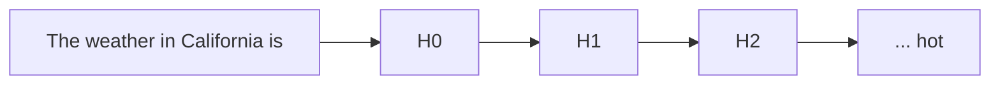
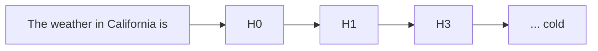
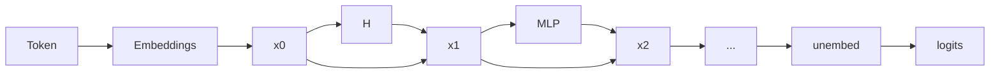

## agency

The ability and freedom for an individual to _act_ based on their immediate context and interests.

Ivan Illich [@illich1973tools] claimed that through proper use of technology, one can reclaim agency and practical
knowledge for your everyday Joe.

> Tools for conviviality (conviviality means 'alive with') suppress other ideas and systems of knowledge and
> concentrate control of knowledge and power in the few and the elite [...] - [Tools for Conviviality](https://jzhao.xyz/thoughts/Tools-for-Conviviality)

The idea of agency for machine learning is that models have the ability to enact on their own without human
intervention. Given the emergent properties of "intelligence" in these systems, it is crucial for us to understand
their world view such that we can make informed decisions for building interfaces that will amplify our own cognitive
abilities.

See also [Alex Obenauer's work on personal computing](https://alexanderobenauer.com/), [Self-Determination Theory](https://selfdeterminationtheory.org/theory/)

## inlay hints

Special markers that appear in your editor to provide additional context about context of the code[^2]

[^2]: [Introduction from JetBrains](https://www.jetbrains.com/help/idea/inlay-hints.html), but this is implemented widely in other IDEs as well (VSCode, Neovim, Emacs, etc.)

In a context of a text editor, inlay hints can work as a suggestion from a providers based on current context.

## auto-regressive model

A statistical model is autoregressive if it predicts future values based on past values. For example,
an autoregressive model might seek to predict a stock’s future prices based on its past performance.

In context of LLMs, generative pre-trained [[glossary#transformers|transformers]] (GPTs) are derivations of
auto-regressive models where it takes an input sequence of tokens length $n$ and predicting the next token at index
$n+1$.

Auto-regressive models are often considered a more correct terminology when describing text-generation models.

## transformers

A multi-layer perception (MLP) archiecture built on top of a multi-head attention mechanism [@vaswani2023attentionneed] to signal high entropy tokens to be amplified and less important tokens to be diminished.

## low-rank adapters

Paper: "LoRA: Low-Rank Adaptation of Large Language Models" [@hu2021loralowrankadaptationlarge], [GitHub](https://github.com/microsoft/LoRA)

> ELI5: Imagine you have a big complex toy robot. Now you want to teach this robot some new tricks. With LoRA, you are
> giving this robot a small backpack. This backpack won't change how the robot function, but will give it some new cool
> tricks. Now with SAEs, you are adding enhancement directly into the robot, which makes it a lot better at some certain
> tricks.

The idea is to freeze a majority of the network weights, and inject trainable rank decomposition matrices to influence
the models' outputs.

each LoRA layer can then be merged with the main models, in which create specialised models on given tasks. The main
benefit of LoRA is to reduce costs for fine-tuning tasks.

In a sense, LoRA is a different comparing sparse autoencoders.

- For LoRA, we are controlling the outputs of a models by training additional "parameters" to add into the models
- With SAEs, we are directly editing features activations within the neural net, which means we don't have to worry
  about fine-tuning the model. We observe this through [Claude's Golden Gate Bridge](https://www.anthropic.com/news/golden-gate-claude).

## mechanistic interpretability

alias: mech interp

The subfield of alignment that delves into reverse engineering of a neural network.

To attack the _curse of dimensionality_, the question remains: ==How do we hope to understand a function over such
a large space, without an exponential amount of time?==

## manual steering

also known as [[glossary#features]] steering

refers to the process of manually modifying certain activations and hidden state of the neural net to influence its
outputs

For example, the following is a toy example of how GPT2 generate text given the prompt "The weather in California is"



To steer to model, we modify $H_2$ layers with certain features amplifier with scale 20 (called it $H_{3}$)[^3]

[^3]: This is a toy representation of hidden layers in MLP, in practice, these models contain ~ 96 layers of MLP or more.



One usually use techniques such as [[glossary#sparse autoencoders]] to decompose model activations into a set of
interpretable features.

For feature [[glossary#ablation]], we observe that manipulation of features activation can be strengthened or weakened
to directly influence the model's outputs

## superposition hypothesis

> Linear representation of neurons can represent more features than dimensions. As sparsity increases, model use
> superposition to represent more [[glossary#features]] than dimensions.

When features are sparsed, superposition allows compression beyond what linear model can do, at a cost of interference
that requires non-linear filtering.

## features

When we talk about features [see section "Empirical Phenomena" of @elhage2022superposition], the theory building around
several observed empirical phenomena:

1. Word Embeddings: have direction which coresponding to semantic properties [@mikolov-etal-2013-linguistic]. For
   example:
   ```prolog
   V(king) - V(man) = V(monarch)
   ```
2. Latent space: similar vector arithmetics and interpretable directions have also been found in generative adversarial
   network.

We can define features as properties of inputs which a sufficiently large neural network will reliably dedicate
a neuron to represent [see section "Features as Direction" of @elhage2022superposition]

## hyperparameter tuning

Refers to the process of optimizing the hyperparameters of a model to improve its performance on a given task.

In the context of mech interp, we refer to adjusting given scale and [[Scratch#entropy]] of given feature vectors.

## ablation

In machine learning, ablation refers to the process of removing a subset of a model's parameters to evaluate its
predictions outcome.

Often also referred as feature pruning, but they have some slightly different meaning.

## residual stream



residual stream $x_{0}$ has dimension $\mathit{(C,E)}$ where

- $\mathit{C}$: the number of tokens in context windows and
- $\mathit{E}$: embedding dimension.

attention mechanism $\mathit{H}$ process given residual stream $x_{0}$ as the result is added back to $x_{1}$:

$$
x_{1} = \mathit{H}{(x_{0})} + x_{0}
$$

## inference

Refers to the process of running the model based on real world inputs to generate text completions.

next-token prediction is commonly used in the context of LLMs.

## time-to-first-tokens

Denotes the latency between request arrivate and the first output token generated by system for the request.

minimise TTFT will help with UX for users.

## sparse autoencoders

abbreviation: SAE

Often contains one layers of MLP with few linear ReLU that is trained on a subset of datasets the main LLMs is trained
on.

For example, if we wish to interpret all features related to the author Camus, we might want to train an SAEs based on
all given text of Camus that is also found in Llama-3.1

[^ref]
