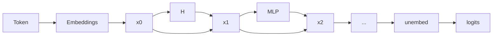

## mechanistic interpretability

The subfield of alignment that delves into reverse engineering of a neural network.

To attack the _curse of dimensionality_, the question remains: ==How do we hope to understand a function over such
a large space, without an exponential amount of time?==

## residual stream

residual stream $x_{0}$ has dimension $\mathit{(C,E)}$ where

- $\mathit{C}$: the number of tokens in context windows and
- $\mathit{E}$: embedding dimension.

attention mechanism $\mathit{H}$ process given residual stream $x_{0}$ as the result is added back to $x_{1}$:

$$
x_{1} = \mathit{H}{(x_{0})} + x_{0}
$$

## sparse autoencoders

abbreviation: SAE
