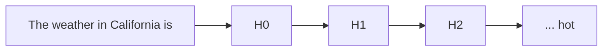
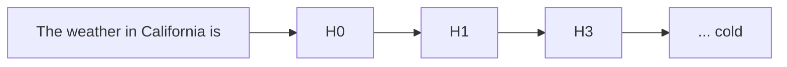

The following encapsulates commonly used terms throughout `tinymorph`. By all means it includes
both technical and non-technical definitions that should help with knowing about the system.

## inlay hints

Special markers that appear in your editor to provide additional context about context of the code[^2]

[^2]: [Introduction from JetBrains](https://www.jetbrains.com/help/idea/inlay-hints.html), but this is implemented widely in other IDEs as well (VSCode, Neovim, Emacs, etc.)

In a context of a text editor, inlay hints can work as a suggestion from a providers based on current context.

## auto-regressive model

A statistical model is autoregressive if it predicts future values based on past values. For example,
an autoregressive model might seek to predict a stock’s future prices based on its past performance.

In context of LLMs, generative pre-trained [[glossary#transformers|transformers]] (GPTs) are derivations of
auto-regressive models where it takes an input sequence of tokens length $n$ and predicting the next token at index
$n+1$.

Auto-regressive models are often considered a more correct terminology when describing text-generation models.

## transformers

A multi-layer perception (MLP) architecture built on top of a multi-head attention mechanism [@vaswani2023attentionneed] to signal high entropy tokens to be amplified and less important tokens to be diminished.

## low-rank adapters

Paper: "LoRA: Low-Rank Adaptation of Large Language Models" [@hu2021loralowrankadaptationlarge], [GitHub](https://github.com/microsoft/LoRA)

> ELI5: Imagine you have a big complex toy robot. Now you want to teach this robot some new tricks. With LoRA, you are
> giving this robot a small backpack. This backpack won't change how the robot function, but will give it some new cool
> tricks. Now with SAEs, you are adding enhancement directly into the robot, which makes it a lot better at some certain
> tricks.

The idea is to freeze a majority of the network weights, and inject trainable rank decomposition matrices to influence
the models' outputs.

each LoRA layer can then be merged with the main models, in which create specialised models on given tasks. The main
benefit of LoRA is to reduce costs for fine-tuning tasks.

In a sense, LoRA is a different comparing [[glossary#sparse autoencoders]]

- For LoRA, we are controlling the outputs of a models by training additional "parameters" to add into the models
- With SAEs, we are directly editing features activations within the neural net, which means we don't have to worry
  about fine-tuning the model. We observe this through [Claude's Golden Gate Bridge](https://www.anthropic.com/news/golden-gate-claude).

## mechanistic interpretability

alias: mech interp

The subfield of alignment that delves into reverse engineering of a neural network.

To attack the _curse of dimensionality_, the question remains: ==How do we hope to understand a function over such
a large space, without an exponential amount of time?==

## manual steering

also known as [[glossary#features]] steering

refers to the process of manually modifying certain activations and hidden state of the neural net to influence its
outputs

For example, the following is a toy example of how GPT2 generate text given the prompt "The weather in California is"



To steer to model, we modify $H_2$ layers with certain features amplifier with scale 20 (called it $H_{3}$)[^3]

[^3]: This is a toy representation of hidden layers in MLP, in practice, these models contain ~ 96 layers of MLP or more.



One usually use techniques such as [[glossary#sparse autoencoders]] to decompose model activations into a set of
interpretable features.

For feature [[glossary#ablation]], we observe that manipulation of features activation can be strengthened or weakened
to directly influence the model's outputs

## superposition hypothesis

> Linear representation of neurons can represent more features than dimensions. As sparsity increases, model use
> superposition to represent more [[glossary#features]] than dimensions.

When features are sparsed, superposition allows compression beyond what linear model can do, at a cost of interference
that requires non-linear filtering.

## features

When we talk about features [@elhage2022superposition{see "Empirical Phenomena"}], the theory building around
several observed empirical phenomena:

1. Word Embeddings: have direction which coresponding to semantic properties [@mikolov-etal-2013-linguistic]. For
   example:
   ```prolog
   V(king) - V(man) = V(monarch)
   ```
2. Latent space: similar vector arithmetics and interpretable directions have also been found in generative adversarial
   network.

We can define features as properties of inputs which a sufficiently large neural network will reliably dedicate
a neuron to represent [@elhage2022superposition{see "Features as Direction"}]

## hyperparameter tuning

Refers to the process of optimizing the hyperparameters of a model to improve its performance on a given task.

In the context of mech interp, we refer to adjusting given scale and [[Scratch#entropy]] of given feature vectors.

## ablation

In machine learning, ablation refers to the process of removing a subset of a model's parameters to evaluate its
predictions outcome.

Often also referred as feature pruning, but they have some slightly different meaning.

## residual stream


residual stream $x_{0}$ has dimension $\mathit{(C,E)}$ where

- $\mathit{C}$: the number of tokens in context windows and
- $\mathit{E}$: embedding dimension.

attention mechanism $\mathit{H}$ process given residual stream $x_{0}$ as the result is added back to $x_{1}$:

$$
x_{1} = \mathit{H}{(x_{0})} + x_{0}
$$

## logits

the logit function is the quantile function associated with the standard logistic distribution

## inference

Refers to the process of running the model based on real world inputs to generate text completions.

next-token prediction is commonly used in the context of LLMs.

## time-to-first-tokens

Denotes the latency between request arrivate and the first output token generated by system for the request.

minimise TTFT will help with UX for users.

## sparse autoencoders

abbrev: SAE

Often contains one layers of MLP with few linear ReLU that is trained on a subset of datasets the main LLMs is trained on.

_see also: [landspace](https://docs.google.com/document/d/1lHvRXJsbi41bNGZ_znGN7DmlLXITXyWyISan7Qx2y6s/edit?tab=t.0#heading=h.j9b3g3x1o1z4), [more technical details](https://aarnphm.xyz/thoughts/mechanistic-interpretability#sparse-autoencoders)_

> empirical example: if we wish to interpret all features related to the author Camus, we might want to train an SAEs based on all given text of Camus
> to interpret "similar" features from Llama-3.1

> [!abstract] definition
>
> We wish to decompose a models' activitation $x \in \mathbb{R}^n$ into sparse, linear combination of feature directions:
>
> $$
> x \sim x_{0} + \sum_{i=1}^{M} f_i(x) d_i
> \\
> \\
> \\
> \because \begin{aligned}
>  d_i M \gg n&:\text{ latent unit-norm feature direction} \\
> f_i(x) \ge 0&: \text{ coresponding feature activation for }x
> \end{aligned}
> $$

Thus, the baseline architecture of SAEs is a linear autoencoder with L1 penalty on the activations:

$$
\begin{aligned}
f(x) &\coloneqq \text{ReLU}(W_\text{enc}(x - b_\text{dec}) + b_\text{enc}) \\
\hat{x}(f) &\coloneqq W_\text{dec} f(x) + b_\text{dec}
\end{aligned}
$$

> training it to reconstruct a large dataset of model activations $x \sim \mathcal{D}$, constraining hidden representation $f$ to be sparse

[[thoughts/university/twenty-four-twenty-five/sfwr-4ml3/tut/tut1#^l1norm|L1 norm]] with coefficient $\lambda$ to construct loss during training:

$$
\mathcal{L}(x) \coloneqq \| x-\hat{x}(f(x)) \|_2^2 + \lambda \| f(x) \|_1
\\
\because \|x-\hat{x}(f(x)) \|_2^2 : \text{ reconstruction loss}
$$

> [!important] intuition
>
> We need to reconstruction fidelity at a given sparsity level, as measured by L0 via a mixture of reconstruction fidelity and L1 regularization.

We can reduce sparsity loss term without affecting reconstruction by scaling up norm of decoder weights, or constraining norms of columns $W_\text{dec}$ durin training

Ideas: output of decoder $f(x)$ has two roles

- detects what features acre active <= L1 is crucial to ensure sparsity in decomposition
- _estimates_ magnitudes of active features <= L1 is unwanted bias

### Gated SAE

see also: [paper](https://arxiv.org/abs/2404.16014)

_uses Pareto improvement over training to reduce L1 penalty_ [@rajamanoharan2024improvingdictionarylearninggated]

Clear consequence of the bias during training is _shrinkage_ [@sharkey2024feature] [^shrinkage]

[^shrinkage]:
    If we hold $\hat{x}(\bullet)$ fixed, thus L1 pushes $f(x) \to 0$, while reconstruction loss pushes $f(x)$ high enough to produce accurate reconstruction.<br>
    An optimal value is somewhere between. However, rescaling the shrink feature activations is not necessarily enough to overcome bias induced by L1: a SAE might learnt sub-optimal encoder and decoder directions that is not improved by the fixed.

Idea is to use Gated ReLU encoder [@shazeer2020gluvariantsimprovetransformer; @dauphin2017languagemodelinggatedconvolutional]:

$$
\tilde{f}(\mathbf{x}) \coloneqq \underbrace{\mathbb{1}[\underbrace{(\mathbf{W}_{\text{gate}}(\mathbf{x} - \mathbf{b}_{\text{dec}}) + \mathbf{b}_{\text{gate}}) > 0}_{\pi_{\text{gate}}(\mathbf{x})}]}_{f_{\text{gate}}(\mathbf{x})} \odot \underbrace{\text{ReLU}(\mathbf{W}_{\text{mag}}(\mathbf{x} - \mathbf{b}_{\text{dec}}) + \mathbf{b}_{\text{mag}})}_{f_{\text{mag}}(\mathbf{x})}
$$

where $\mathbb{1}[\bullet > 0]$ is the (pointwise) Heaviside step function and $\odot$ denotes elementwise multiplication.

| term                 | annotations                                                                     |
| -------------------- | ------------------------------------------------------------------------------- |
| $f_\text{gate}$      | which features are deemed to be active                                          |
| $f_\text{mag}$       | feature activation magnitudes (for features that have been deemed to be active) |
| $\pi_\text{gate}(x)$ | $f_\text{gate}$ sub-layer's pre-activations                                     |

to negate the increases in parameters, use ==weight sharing==:

Scale $W_\text{mag}$ in terms of $W_\text{gate}$ with a vector-valued rescaling parameter $r_\text{mag} \in \mathbb{R}^M$:

$$
(W_\text{mag})_{ij} \coloneqq (\exp (r_\text{mag}))_i \cdot (W_\text{gate})_{ij}
$$

![[images/gated-sae-architecture.png]]

_figure 3: Gated SAE with weight sharing between gating and magnitude paths_

![[images/jump_relu.png]]

_figure 4: A gated encoder become a single layer linear encoder with Jump ReLU_ [@erichson2019jumpreluretrofitdefensestrategy] _activation function_ $\sigma_\theta$

### feature suppression

See also [link](https://www.alignmentforum.org/posts/3JuSjTZyMzaSeTxKk/addressing-feature-suppression-in-saes)

Loss function of SAEs combines a MSE reconstruction loss with sparsity term:

$$
L(x, f(x), y) = \|y-x\|^2/d + c\mid f(x) \mid
\\
\because d: \text{ dimensionality of }x
$$

> the reconstruction is not perfect, given that only one is reconstruction. **For smaller value of $f(x)$, features will be suppressed**

## retrieval augmented generation

First introduced by [@lewis2021retrievalaugmentedgenerationknowledgeintensivenlp] which introduces a pipeline that
includes a retriever models $p_n$ queried from existing knowledge base to improve correctness and reduce [[glossary#hallucinations]]
in LLM generations.

How would this work with SAEs specifically?

- Run an embedding models => SAEs to interpret features from relevant documents. => Search related features.
- Added said documents embedded in input tensors => better planning for contextual embeddings.

See also [Contextual Document Embeddings](https://arxiv.org/abs/2410.02525)

## hallucinations

A phenomenon where contents generated by LLMs are misleading and inconsistent with real-world facts or users inputs.
This poses a threat to the safety of the system, as it can lead to misinformation and harmful outcomes [@huang2023surveyhallucinationlargelanguage]

## KV cache block

While generating tokens in auto-regressive models, previously generated tokens are fed into the network again while
generating a new tokens. As input sequence becomes longer, inference [[glossary#FLOPs]] will grow exponentially.

KV cache solves this problem by storing hidden representations or previously computed key-value pairs while generating
a new tokens.

the KV-cache will then be prefilled during forward propagation.

See also [source](https://kipp.ly/transformer-inference-arithmetic/)

## FLOPs

Also known as floating point operations. Used as a common metric to measure the the computer performance.

## agency

The ability and freedom for an individual to _act_ based on their immediate context and interests.

Ivan Illich [@illich1973tools] claimed that through proper use of technology, one can reclaim agency and practical
knowledge for your everyday Joe.

> Tools for conviviality (conviviality means 'alive with') suppress other ideas and systems of knowledge and
> concentrate control of knowledge and power in the few and the elite [...] - [Tools for Conviviality](https://jzhao.xyz/thoughts/Tools-for-Conviviality)

The idea of agency for machine learning is that models have the ability to enact on their own without human
intervention. Given the emergent properties of "intelligence" in these systems, it is crucial for us to understand
their world view such that we can make informed decisions for building interfaces that will amplify our own cognitive
abilities.

See also [Alex Obenauer's work on personal computing](https://alexanderobenauer.com/), [Self-Determination Theory](https://selfdeterminationtheory.org/theory/)

## data

Representation of information in a formalised manner suitable for communication, interpretation, or processing by humans or by automatic means.

## connectionism

Initially conceptualized to represent neural circuitry through mathematical approach. [@rosenblatt1958perceptron]

Second wave blossomed in late 1980s, followed by Parallel Distributed Processing group
[@10.7551/mitpress/5236.001.0001], where it introduced intermediate processors within the network (often known as
"hidden layers") alongside with inputs and outputs. Notable figures include John Hopfield, Terence Horgan.

Third waves (the current meta we are in) are marked by the rise in deep learning, notable contributions include the
rise to fame of large language models. This era focuses artifical neural networks, focusing on designing efficient
architecture to utilize available computes.

## bias bug

The primary methods on fighting against bias bugs in contemporary AI system includes increase in data diversity.

There is a timeless saying in computer science "Garbage in Garbage out", which essentially states that bad data will produce outputs that's of equal quality.
This is most prevalent in AI, given the existence of these networks within a black-box model. One case of this is the very first iterations of Google Photos’ image
recognition where it identified people with darker skins as “gorillas” [@BBCGoogleApology2015].

Truth is, data lacks context. A prime example of this US’ COMPAS used by US courts to assess the likelihood of criminal to reoffend. ProPublica concluded that COMPAS was inherently
biased towards those of African descent, citing that it overestimated the false positives rate for those of African descent by two folds [@AngwinLarsonMattuKirchner2016]. Interestingly, a study done at Darthmouth showed
a surprising accuracy on the rate of recidivism with random volunteers when given the same information as the COMPAS algorithm [@doi:10.1126/sciadv.aao5580].
The question remains, how do we solve fairness and ensure DEI for marginalized groups when there is obviously prejudice and subjectivity that introduce bias at play?
It is not a problem we can’t solve, rather collectively we should define what makes an algorithm **fair**.

[^ref]
